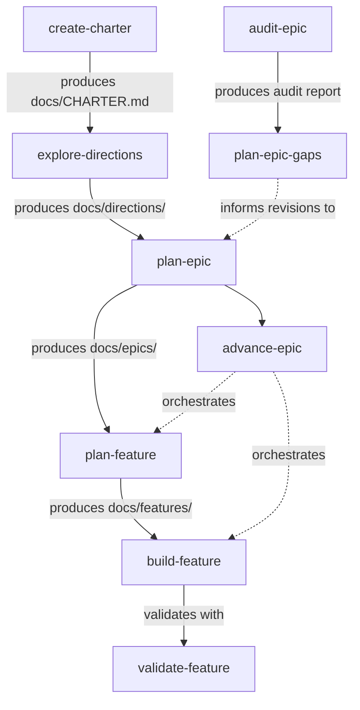
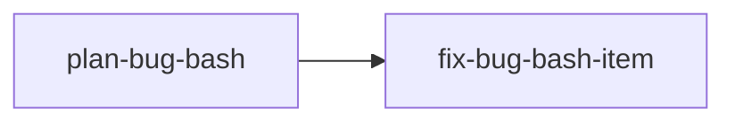
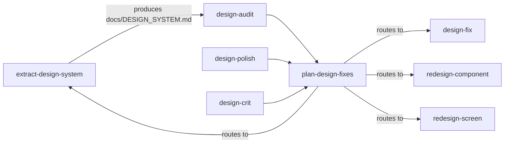
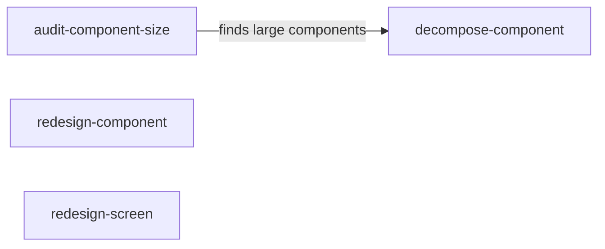
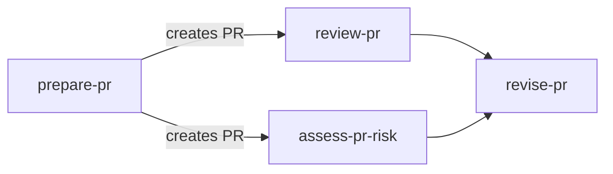
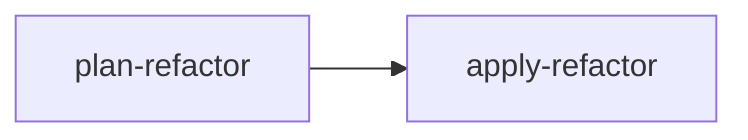
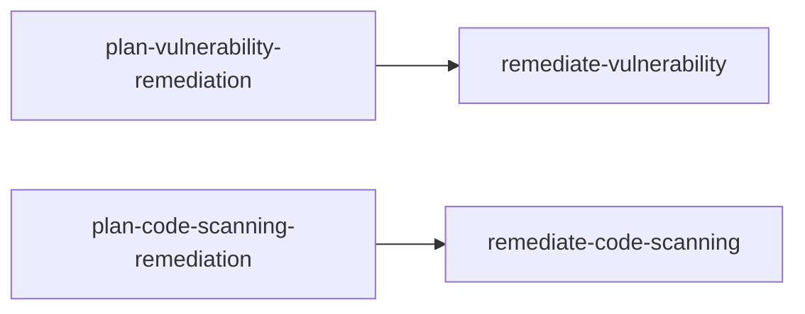
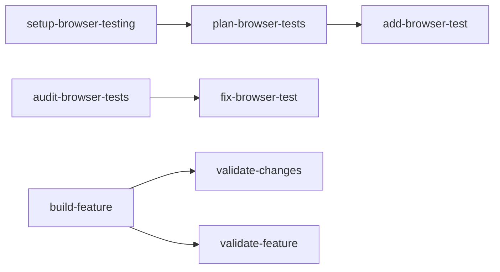

# Skills

Collected agent skills for Claude Code.

Skills organize around two dimensions — **mode** (convergence vs divergence) and **phase** (analyze, plan, execute) — and come in two types: **workflow** and **reference**. See [PHILOSOPHY.md](PHILOSOPHY.md) for the full framework.

Skills are installed by symlinking SKILL.md files into a directory the AI tool reads. See [cli/README.md](cli/README.md) for CLI installation, usage, and full documentation. See [MECHANICS.md](MECHANICS.md) for how lazy loading works, where to install (global vs project), and how skill groups are organized.

## Product

Skills for product direction, planning, and quality.

### Direction

| Skill                                                  | Type     | Mode       | Phase   | Description                                                                                                                   |
| ------------------------------------------------------ | -------- | ---------- | ------- | ----------------------------------------------------------------------------------------------------------------------------- |
| [explore-directions](registry/explore-directions/SKILL.md) | workflow | divergence | analyze | Analyze the product's current state and generate 3–5 distinct strategic directions with evidence and trade-offs for review. |
| [create-charter](registry/create-charter/SKILL.md)     | workflow | divergence | plan    | Create or refresh a product charter (CHARTER.md) that serves as the north star for all downstream planning.                   |
| [plan-epic](registry/plan-epic/SKILL.md)               | workflow | divergence | plan    | Create a structured epic plan that translates a product charter into a quarter-level initiative.                              |
| [plan-feature](registry/plan-feature/SKILL.md)         | workflow | divergence | execute | Create a structured feature plan that defines a 1–2 week deliverable and links it to a parent epic.                           |
| [build-feature](registry/build-feature/SKILL.md)       | workflow | convergence | execute | Implement one acceptance criterion from a feature plan — write code, verify, commit, and check it off. Run repeatedly until the feature is complete. |
| [advance-epic](registry/advance-epic/SKILL.md)         | workflow | convergence | execute | Advance an epic by planning and implementing its next incomplete child feature. Run repeatedly until the epic is complete.    |
| [audit-epic](registry/audit-epic/SKILL.md)             | workflow | convergence | analyze | Audit an epic to find missing, inconsistent, or incomplete child features — cross-references feature plans against the epic and reports gaps. |
| [plan-epic-gaps](registry/plan-epic-gaps/SKILL.md)     | workflow | convergence | plan    | Create a prioritized plan to close gaps found by audit-epic — maps each gap to a concrete action and produces a structured punch list.        |

### Bug Bash

| Skill                                                    | Type     | Mode        | Phase         | Description                                                                                                                    |
| -------------------------------------------------------- | -------- | ----------- | ------------- | ------------------------------------------------------------------------------------------------------------------------------ |
| [plan-bug-bash](registry/plan-bug-bash/SKILL.md)         | workflow |             | analyze, plan | Process stream-of-consciousness dictation about bugs and issues into a structured, prioritized plan of discrete units of work. |
| [fix-bug-bash-item](registry/fix-bug-bash-item/SKILL.md) | workflow | convergence | execute       | Execute one fix from a bug bash plan — investigate, apply a targeted fix, verify, commit, push, and open a PR.                 |

## Design

Skills for UI/UX, design systems, and visual polish.

### System

| Skill                                                            | Type     | Mode        | Phase   | Description                                                                                                  |
| ---------------------------------------------------------------- | -------- | ----------- | ------- | ------------------------------------------------------------------------------------------------------------ |
| [extract-design-system](registry/extract-design-system/SKILL.md) | workflow | divergence  | analyze | Extract the implicit design system from a codebase into a documented contract (`docs/DESIGN_SYSTEM.md`).     |
| [design-audit](registry/design-audit/SKILL.md)                   | workflow | convergence | analyze | Scan pages or components against the design system contract and find deviations.                             |
| [design-fix](registry/design-fix/SKILL.md)                       | workflow | convergence | execute | Fix design system deviations identified by design-audit — mechanical, batchable alignment work.              |

### Critique

| Skill                                                  | Type     | Mode       | Phase   | Description                                                                                                                         |
| ------------------------------------------------------ | -------- | ---------- | ------- | ----------------------------------------------------------------------------------------------------------------------------------- |
| [design-polish](registry/design-polish/SKILL.md)       | workflow | convergence | analyze | Evaluate a UI at the component level for visual polish — spacing, alignment, typography, color, and pixel-level issues.             |
| [design-crit](registry/design-review/SKILL.md)         | workflow | divergence  | analyze | Evaluate a UI at the page/app level for structural UX quality — information hierarchy, navigation, content prioritization, and page structure. |
| [plan-design-fixes](registry/plan-design-fixes/SKILL.md) | workflow | convergence | plan    | Create a prioritized, sequenced punch list from design-polish, design-crit, or design-audit findings — triages each item and routes it to the right execution path. |

### Components

| Skill                                                          | Type     | Mode        | Phase                  | Description                                                                                                                           |
| -------------------------------------------------------------- | -------- | ----------- | ---------------------- | ------------------------------------------------------------------------------------------------------------------------------------- |
| [audit-component-size](registry/audit-component-size/SKILL.md) | workflow | convergence | analyze                | Scan a codebase to find React components that have grown too large and are good candidates for decomposition.                         |
| [decompose-component](registry/decompose-component/SKILL.md)   | workflow | convergence | execute                | Break a large React component into smaller, well-named sub-components in separate files.                                              |
| [redesign-component](registry/redesign-component/SKILL.md)     | workflow | divergence  | analyze, plan, execute | Redesign a UI component that has outgrown its original layout — audit what it displays and does, then propose and implement a better layout. |
| [redesign-screen](registry/redesign-screen/SKILL.md)           | workflow | divergence  | analyze, plan, execute | Redesign a screen or page that has become cluttered or poorly organized as features accumulated.                                      |

### References

| Skill                                                | Type      | Description                                                                                                                                           | Origin                                                                                     |
| ---------------------------------------------------- | --------- | ----------------------------------------------------------------------------------------------------------------------------------------------------- | ------------------------------------------------------------------------------------------ |
| [svg-animations](registry/svg-animations/SKILL.md)   | reference | Create performant SVG animations and illustrations: path animations, shape morphing, loading spinners, animated logos, gradients, masks, and filters. | [supermemoryai](https://github.com/supermemoryai/skills/blob/main/svg-animations/SKILL.md) |
| [color-expert](registry/color-expert/SKILL.md)       | reference | Color science expert — color theory, accessibility standards, palette generation, and practical color tools.                                          | [meodai](https://github.com/meodai/skill.color-expert)                                     |
| [emil-design-eng](registry/emil-design-eng/SKILL.md) | reference | Design engineering philosophy — polished animations, thoughtful component design, and invisible details that make software feel great.                | [emilkowalski](https://github.com/emilkowalski/skill)                                      |

**References:** [components.build](https://www.components.build/) · [frontend-guidelines](https://github.com/bendc/frontend-guidelines)

## Engineering

Skills for code, architecture, testing, security, and delivery.

### Git Workflow

| Skill                                              | Type     | Mode        | Phase   | Description                                                                                                         |
| -------------------------------------------------- | -------- | ----------- | ------- | ------------------------------------------------------------------------------------------------------------------- |
| [stash-work](registry/stash-work/SKILL.md)         | workflow |             | execute | Stash in-progress work onto a local `wip/` branch with a descriptive commit and context file.                       |
| [save-session](registry/save-session/SKILL.md)     | workflow |             | analyze | Summarize the current working session and save it to `docs/tmp/`.                                                   |
| [prepare-pr](registry/prepare-pr/SKILL.md)         | workflow |             | execute | Prepare a pull request from a local branch — inspect changes, write a conventional commit, push, and open a PR.     |
| [revise-pr](registry/revise-pr/SKILL.md)           | workflow | convergence | execute | Revise an existing PR to ensure the title, description, and checklist accurately reflect the latest commits.        |
| [review-pr](registry/review-pr/SKILL.md)           | workflow |             | analyze | Review a pull request and post inline code review comments with an overall verdict.                                 |
| [assess-pr-risk](registry/assess-pr-risk/SKILL.md) | workflow |             | analyze | Assess the risk level of a pull request across blast radius, security sensitivity, test coverage, and dependencies. |

### Core Language

TypeScript and JavaScript best practices — reference skills that inform how code is written across the stack.

| Skill                                                        | Type      | Description                                                                                                                  |
| ------------------------------------------------------------ | --------- | ---------------------------------------------------------------------------------------------------------------------------- |
| [functional-patterns](registry/functional-patterns/SKILL.md) | reference | Immutability, pure functions, array methods over imperative loops, composition over inheritance, avoiding side effects.      |
| [typescript-types](registry/typescript-types/SKILL.md)       | reference | No `any`, discriminated unions, type narrowing, `satisfies`, branded types, deriving types from values.                      |
| [error-handling](registry/error-handling/SKILL.md)           | reference | Error as values (Result types), typed errors, throw for exceptional cases only, catch at system boundaries.                  |
| [async-patterns](registry/async-patterns/SKILL.md)           | reference | async/await over raw promises, `Promise.all` for concurrency, AbortController, race condition guards, limiting concurrency.  |

### Refactoring

| Skill                                                | Type     | Mode        | Phase   | Description                                                                                                                   |
| ---------------------------------------------------- | -------- | ----------- | ------- | ----------------------------------------------------------------------------------------------------------------------------- |
| [plan-refactor](registry/plan-refactor/SKILL.md)     | workflow | convergence | plan    | Create a structured maintainability refactor plan for large, tangled, poorly organized, or hard-to-navigate code.             |
| [apply-refactor](registry/apply-refactor/SKILL.md)   | workflow | convergence | execute | Implement the next unchecked task from a refactor plan — one behavior-preserving split, move, extraction, or cleanup at a time. |

### React SPA

| Skill                                                                | Type      | Description                                                                                                                                |
| -------------------------------------------------------------------- | --------- | ------------------------------------------------------------------------------------------------------------------------------------------ |
| [react-component-design](registry/react-component-design/SKILL.md)   | reference | Component size, single responsibility, compositional patterns, and "branch early" — prefer distinct components over prop-toggled behavior. |
| [react-project-structure](registry/react-project-structure/SKILL.md) | reference | Base UI as a design system layer, domain components in `src/features/`, naming conventions, and feature module boundaries.                 |
| [react-spa-architecture](registry/react-spa-architecture/SKILL.md)   | reference | App entrypoints, provider composition, routing setup, environment config, API clients, auth bootstrap, and SPA deployment concerns.        |
| [react-hooks-effects](registry/react-hooks-effects/SKILL.md)         | reference | Effects as escape hatches, dependency arrays, cleanup, stale closures, refs vs state, Strict Mode, and custom hook boundaries.             |
| [react-form-patterns](registry/react-form-patterns/SKILL.md)         | reference | Form-library contexts for non-trivial forms, reusable field components, schema-level validation, dirty tracking, and wizards.              |
| [react-state-management](registry/react-state-management/SKILL.md)   | reference | Keep state low, minimize global state, treat URL/form/server/local state differently, derive don't sync.                                   |
| [react-data-fetching](registry/react-data-fetching/SKILL.md)         | reference | Server-state fetching, query keys, colocated API clients, mutations, invalidation, optimistic updates, pagination, and prefetching.        |
| [react-routing](registry/react-routing/SKILL.md)                     | reference | RESTful URL design, new views = new URLs, URL as source of truth for navigational state.                                                   |
| [react-performance](registry/react-performance/SKILL.md)             | reference | Profile first, then optimize — React.memo, useMemo/useCallback, code splitting, virtualization, concurrent features.                       |
| [react-error-handling](registry/react-error-handling/SKILL.md)       | reference | Error Boundaries at feature boundaries, Suspense for loading states, fallback UI design, route-level error handling.                       |
| [react-accessibility](registry/react-accessibility/SKILL.md)         | reference | Semantic HTML first, keyboard navigation, ARIA patterns, focus management, accessible forms, live regions, color/contrast.                 |
| [react-testing](registry/react-testing/SKILL.md)                     | reference | Integration tests for critical flows, unit tests for business logic, minimal component tests — test ROI over coverage percentage.          |

### Python And FastAPI

| Skill                                                                                  | Type      | Description                                                                                                                           |
| -------------------------------------------------------------------------------------- | --------- | ------------------------------------------------------------------------------------------------------------------------------------- |
| [python-project-structure](registry/python-project-structure/SKILL.md)                 | reference | Organize Python packages, modules, entrypoints, configuration, imports, scripts, services, utilities, and tests.                       |
| [python-testing](registry/python-testing/SKILL.md)                                     | reference | Pytest suites, fixtures, dependency overrides, async tests, mocks, factories, integration tests, and regression coverage.              |
| [python-typing-data-modeling](registry/python-typing-data-modeling/SKILL.md)           | reference | Type hints, Pydantic models, dataclasses, DTOs, `TypedDict`, `Protocol`, validation boundaries, and serialization.                     |
| [python-async-boundaries](registry/python-async-boundaries/SKILL.md)                   | reference | Async boundaries, FastAPI handlers, async database access, background tasks, cancellations, timeouts, and blocking-call risks.         |
| [python-error-handling](registry/python-error-handling/SKILL.md)                       | reference | Python exceptions, domain errors, API/CLI/job boundary translation, logging, retries, validation failures, and rollback behavior.      |
| [python-database-patterns](registry/python-database-patterns/SKILL.md)                 | reference | SQLAlchemy models, sessions, transactions, repositories, migrations, query boundaries, async database access, fixtures, and tests.     |
| [fastapi-architecture](registry/fastapi-architecture/SKILL.md)                         | reference | FastAPI project structure, thin routers, Pydantic schemas, dependency injection, service boundaries, settings, errors, and tests.      |

### Security

| Skill                                                                              | Type     | Mode        | Phase         | Description                                                                                                  |
| ---------------------------------------------------------------------------------- | -------- | ----------- | ------------- | ------------------------------------------------------------------------------------------------------------ |
| [plan-vulnerability-remediation](registry/plan-vulnerability-remediation/SKILL.md) | workflow | convergence | analyze, plan | Triage CVEs, Dependabot alerts, and audit findings, then group them into safe remediation PR plans.          |
| [remediate-vulnerability](registry/remediate-vulnerability/SKILL.md)               | workflow | convergence | execute       | Execute a vulnerability remediation plan — update dependencies, verify the fix, commit, push, and open a PR. |
| [plan-code-scanning-remediation](registry/plan-code-scanning-remediation/SKILL.md) | workflow | convergence | analyze, plan | Triage CodeQL and SAST alerts, then group them into remediation PR plans.                                    |
| [remediate-code-scanning](registry/remediate-code-scanning/SKILL.md)               | workflow | convergence | execute       | Apply source code fixes for CodeQL/SAST alerts, verify the fix, and create or update a pull request.         |

### Testing

| Skill                                                                      | Type     | Mode        | Phase         | Description                                                                                                                                    |
| -------------------------------------------------------------------------- | -------- | ----------- | ------------- | ---------------------------------------------------------------------------------------------------------------------------------------------- |
| [setup-browser-testing](registry/setup-browser-testing/SKILL.md)           | workflow | convergence | execute       | Set up the browser testing facility — installs and configures framework, auth helpers, CI workflow with scheduled runs, and conventions docs.  |
| [plan-browser-tests](registry/plan-browser-tests/SKILL.md)                 | workflow | divergence  | analyze, plan | Analyze an application to identify critical user flows and produce a prioritized browser test plan.                                            |
| [add-browser-test](registry/add-browser-test/SKILL.md)                     | workflow | divergence  | execute       | Implement one browser integration test from the plan — picks the next unchecked flow, writes the test, and verifies it passes.                 |
| [audit-browser-tests](registry/audit-browser-tests/SKILL.md)               | workflow | convergence | analyze       | Audit an existing browser test suite to identify stale tests, missing coverage, flaky patterns, and quality issues.                            |
| [fix-browser-test](registry/fix-browser-test/SKILL.md)                     | workflow | convergence | execute       | Repair a broken or flaky browser test — diagnoses the root cause, applies a targeted fix, and re-runs to confirm.                              |
| [validate-changes](registry/validate-changes/SKILL.md)                     | workflow | convergence | execute       | Run targeted validation against recent code changes — maps diff to relevant tests, runs only those, and reports coverage gaps.                 |
| [validate-feature](registry/validate-feature/SKILL.md)                     | workflow | convergence | execute       | Comprehensive post-build validation — targeted tests, full browser suite, acceptance criteria verification, and structured ship/no-ship report. |

## Other Skill Collections

| Collection                                                                     | Author     |
| ------------------------------------------------------------------------------ | ---------- |
| [andrej-karpathy-skills](https://github.com/multica-ai/andrej-karpathy-skills) | multica-ai |
| [agent-skills](https://github.com/addyosmani/agent-skills)                     | addyosmani |
| [skills](https://github.com/mattpocock/skills)                                 | mattpocock |
| [gstack](https://github.com/garrytan/gstack)                                   | garrytan   |
| [eng-practices](https://github.com/google/eng-practices)                       | google     |
