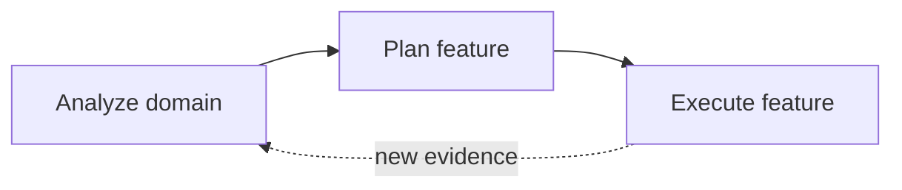
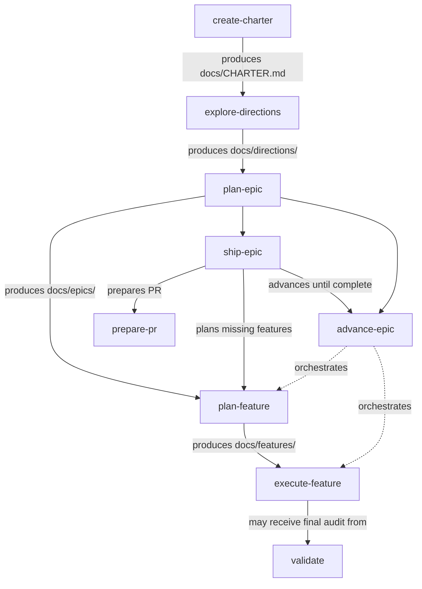
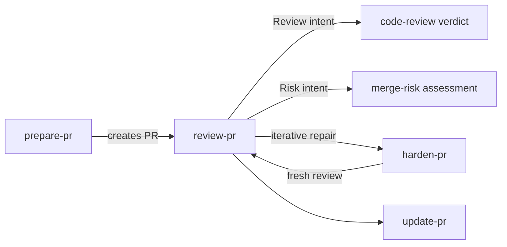
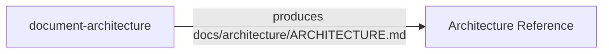
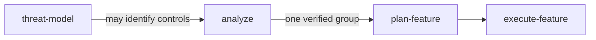
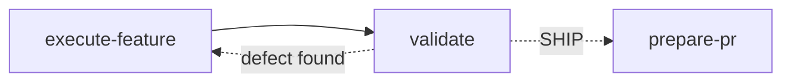

# Skills

This repository is a registry of agent skills. Each skill is a focused `SKILL.md` file that teaches an agent a workflow, convention, or domain-specific judgment pattern.

Use the registry by installing selected skills into the directory your agent client reads, then invoke the relevant skill by name or let the agent choose from the available skill descriptions. See [cli/README.md](cli/README.md) for installation and usage, and [AUTHORING.md](AUTHORING.md) for how to write or update skills.

## Repository Layout

This repository is a skills registry. Active source skills live under
`registry/`, and installers link or copy each selected skill package into the
directory an agent client reads. Archived packages live under `archive/` and
are not discoverable by the installer.

```text
skills/
  registry/
    <skill-name>/
      SKILL.md              # required skill instructions
      agents/
        openai.yaml         # optional agent/client metadata
      references/           # optional templates, examples, rubrics
      scripts/              # optional helper scripts invoked by the skill
      assets/               # optional supporting files
  archive/                  # deprecated packages retained for migration history
  catalog.json              # provenance policy and curated install profiles
  cli/                      # installer and registry tooling
  AUTHORING.md              # how to write and install skills
```

Claude-oriented installs commonly use these locations:

```text
~/.claude/skills/           # personal/global skills
<project>/.claude/skills/   # project-local shared skills
```

Codex or other clients may use analogous roots such as `~/.codex/skills/`, `~/.agents/skills/`, or `<project>/.codex/skills/` depending on client configuration. The registry source remains `registry/<skill-name>/`.

## Taxonomy

Classify a skill on four operational facets:

| Facet | Values | Why it matters |
| --- | --- | --- |
| **Kind** | workflow, reference | Determines the skill's expected structure |
| **Domain** | product, Git/PR, Linear, UI, design, quality, security, testing, and others | Controls installation and routing neighborhoods |
| **Stage** | analyze, plan, execute, review, preserve | Shows where the skill fits in a lifecycle |
| **Effect** | read-only, local files, local Git, network read, external write | Makes authorization and stopping points explicit |

Use **divergence** and **convergence** as optional product-thinking lenses, not
as the primary registry hierarchy. A planning skill may contain both; an
operational Git skill often fits neither.

`catalog.json` is the machine-readable source for curated install profiles and
external-source preservation policy. Skills not explicitly marked external are
registry-maintained. Externally sourced skill bodies are validated against their
origin commit and must be updated from upstream rather than edited locally.

Profiles may include other profiles. `core` intentionally stays small and
operational; install `advisory` when broad cross-domain reference is useful. The
advisory profile composes the maintained reference profiles but deliberately
does not include externally sourced references. Install `linear-ops` for the
focused Linear issue and project creation workflows. Install
`skill-maintenance` only when curating a skill registry, and install
`external-creative` when explicitly opting into preserved third-party creative
references.

Routine convergence workflows use no more than three linear stages. Approval is
a gate between planning and execution, validation belongs inside execution, and
publication remains a separate delivery action. New evidence can send work back
to analysis or planning.


```mermaid
flowchart LR
    A["Analyze domain"] --> P["Plan feature"] --> E["Execute feature"]
    E -.->|"new evidence"| A
```

## Artifacts

Workflow skills create and consume artifacts inside the target project they are helping with. Durable planning artifacts live under a conventional `docs/` workspace.

Root-level all-caps docs are foundational or constitutional: they describe intent, principles, and operating methods. Derived docs that describe the current state of the codebase live under named subdirectories.

```text
<project>/
  docs/
    CHARTER.md                         # product north star
    METHODS.md                         # project methods, engineering principles, and operating approach
    PRESENTATION.md                    # product presentation, identity, voice, and visual direction
    architecture/
      ARCHITECTURE.md                  # derived current-state system architecture
    directions/
      NNN-<slug>.md                    # strategic options from explore-directions
    epics/
      NNN-<slug>.md                    # quarter-level epic plans
    features/
      NNN-<slug>.md                    # feature plans
      NNN-<slug>-validation.md         # validate (Feature mode) report
    security/
      threat-model-<scope>.md          # optional threat-model document
    tmp/
      wip-<name>.md                    # stash context breadcrumb when trackable
```

`docs/directions/`, `docs/epics/`, and `docs/features/` are the standard durable planning surfaces. Product programs and deliberately managed multi-feature initiatives flow through epics. Bounded refactors, security remediations, design-system consolidation, defect fixes, dependency work, and other convergence improvements may go directly from an `analyze` result to `plan-feature`; a parent epic is optional in Convergence mode. `docs/tmp/` is reserved for ephemeral WIP handoff notes.

## Workflow Skills

Workflow skills do work: they analyze a situation, produce planning artifacts, modify code, validate behavior, prepare delivery, or create pull requests.

### Product Direction And Delivery

Workflow skills for product direction, planning, epic/feature delivery, and PR preparation.


```mermaid
flowchart TD
    CC[create-charter] -->|produces docs/CHARTER.md| ED[explore-directions]
    ED -->|produces docs/directions/| PE[plan-epic]
    PE -->|produces docs/epics/| PF[plan-feature]
    PE --> SP[ship-epic]
    SP -->|plans missing features| PF
    SP -->|advances until complete| AE
    SP -->|prepares PR| PPR[prepare-pr]
    PF -->|produces docs/features/| EF[execute-feature]
    EF -->|may receive final audit from| VF[validate]
    PE --> AE[advance-epic]
    AE -.->|orchestrates| PF
    AE -.->|orchestrates| EF
```

| Skill                                                  | Type     | Mode       | Phase   | Description                                                                                                                   |
| ------------------------------------------------------ | -------- | ---------- | ------- | ----------------------------------------------------------------------------------------------------------------------------- |
| [explore-directions](registry/explore-directions/SKILL.md) | workflow | divergence | analyze | Analyze the product's current state and generate 3–5 distinct strategic directions with evidence and trade-offs for review. |
| [create-charter](registry/create-charter/SKILL.md)     | workflow | divergence | plan    | Create or refresh a product charter (CHARTER.md) that serves as the north star for all downstream planning.                   |
| [plan-epic](registry/plan-epic/SKILL.md)               | workflow | divergence | plan    | Create or update one charter-aligned epic, including deduplicating bug-bash or app-feedback observations into coherent child features. |
| [plan-feature](registry/plan-feature/SKILL.md)         | workflow | convergence | plan | Plan one bounded product feature or evidence-backed convergence improvement; parent epics are optional in Convergence mode. |
| [execute-feature](registry/execute-feature/SKILL.md)   | workflow | convergence | execute | Implement and verify one unchecked item from any product or convergence feature plan, create one local commit, and stop. |
| [advance-epic](registry/advance-epic/SKILL.md)         | workflow | convergence | execute | Advance an epic by planning and implementing its next incomplete child feature. Run repeatedly until the epic is complete.    |
| [ship-epic](registry/ship-epic/SKILL.md)               | workflow | convergence | execute | Complete an epic end-to-end — plan missing features, advance until all child features are complete, validate, and prepare a PR. |

### Linear Operations

Focused workflows for creating or polishing one verified Linear record and
stopping. Install the `linear-ops` profile when a team uses Linear.

| Skill | Type | Phase | Description |
| --- | --- | --- | --- |
| [create-issue](registry/create-issue/SKILL.md) | workflow | plan | Resolve live workspace fields, create one Linear issue, verify it, and stop. |
| [create-project](registry/create-project/SKILL.md) | workflow | plan | Resolve live workspace fields, create one Linear project, verify it, and stop. |
| [polish-issue](registry/polish-issue/SKILL.md) | workflow | edit | Improve an issue's language without changing its substance or properties. |

### Analysis Workflows

| Skill | Type | Phase | Description |
| --- | --- | --- | --- |
| [analyze](registry/analyze/SKILL.md) | workflow | analyze | Measure a codebase along a requested dimension — security posture and findings, design-system convergence, quality/maintainability hotspots, or another — and rank bounded feature-sized candidates, read-only. Dimension is a parameter, not a separate skill. |
| [diagnose-failure](registry/diagnose-failure/SKILL.md) | workflow | analyze | Reproduce and localize a software failure, rank hypotheses, and report an evidence-backed cause without editing the project. |

### Skill Registry Maintenance

| Skill | Type | Phase | Description |
| --- | --- | --- | --- |
| [ingest-skill](registry/ingest-skill/SKILL.md) | workflow | analyze, execute | Evaluate one externally created skill, then decline it, merge durable guidance into an existing maintained skill, create one new local skill, or recommend a separate commit-backed external preservation. |

Assess mode is read-only. Apply mode may merge or create locally maintained
skills, but never executes source-provided code, edits preserved packages,
commits, pushes, installs, or publishes.

### Git And PR Workflow


```mermaid
flowchart LR
    PP[prepare-pr] -->|creates PR| RP[review-pr]
    RP -->|Review intent| CR[code-review verdict]
    RP -->|Risk intent| RA[merge-risk assessment]
    RP -->|iterative repair| HP[harden-pr]
    HP -->|fresh review| RP
    RP --> UP[update-pr]
```

| Skill                                              | Type     | Mode        | Phase   | Description                                                                                                         |
| -------------------------------------------------- | -------- | ----------- | ------- | ------------------------------------------------------------------------------------------------------------------- |
| [stash](registry/stash/SKILL.md)                   | workflow | convergence | preserve | Preserve related in-progress work on a local `wip/` branch in one commit with a context note.                     |
| [prepare-pr](registry/prepare-pr/SKILL.md)         | workflow |             | execute | Prepare a pull request from a local branch — inspect changes, write a conventional commit, push, and open a PR.     |
| [review-pr](registry/review-pr/SKILL.md)           | workflow |             | analyze, review | Review a pull request for actionable defects or assess operational and merge risk; post only when explicitly requested. |
| [harden-pr](registry/harden-pr/SKILL.md)           | workflow | convergence | execute, review | Iteratively alternate independent PR reviews with traceable fixes and validation until a bounded convergence or stop condition. |
| [address-review](registry/address-review/SKILL.md) | workflow | convergence | execute, review | Triage inbound reviewer comments — fix, reply, defer, or fold into another PR — then implement, reply to threads, and resolve; gates the push that could dismiss an approval. |
| [rebase-pr](registry/rebase-pr/SKILL.md)           | workflow | convergence | execute | Rebase one or more PR branches onto their base (default staging), reconcile changes upstream already made, then optionally force-push and re-review. |
| [update-pr](registry/update-pr/SKILL.md)           | workflow | convergence | edit | Sync a PR's title and body to the current diff, or polish their language without changing facts; editing GitHub is a separate step. |
| [trim-comments](registry/trim-comments/SKILL.md)   | workflow | convergence | edit | Trim low-value comments a branch's diff introduced — process narration, external ticket/plan references, restated-obvious lines — keeping durable rationale and tool directives. |

### Architecture Documentation


```mermaid
flowchart LR
    DA[document-architecture] -->|produces docs/architecture/ARCHITECTURE.md| AR[Architecture Reference]
```

| Skill                                                | Type     | Mode        | Phase   | Description                                                                                                                   |
| ---------------------------------------------------- | -------- | ----------- | ------- | ----------------------------------------------------------------------------------------------------------------------------- |
| [document-architecture](registry/document-architecture/SKILL.md) | workflow | convergence | analyze | Create or refresh derived `docs/architecture/ARCHITECTURE.md` from the codebase, including Mermaid diagrams for system context, runtime flows, boundaries, and data shape. |

### Security Analysis And Shared Delivery


```mermaid
flowchart LR
    TM[threat-model] -->|may identify controls| AS[analyze]
    AS -->|one verified group| PF1[plan-feature]
    PF1 --> EF1[execute-feature]
```

| Skill | Type | Mode | Phase | Description |
| --- | --- | --- | --- | --- |
| [threat-model](registry/threat-model/SKILL.md) | workflow | divergence | analyze, document | Map assets, actors, data flows, trust boundaries, abuse cases, controls, and residual risk; save a document only when requested. |
| [analyze](registry/analyze/SKILL.md) | workflow | convergence | analyze | Verify, normalize, group, and prioritize posture gaps, dependency advisories, and code-scanning findings (Security dimension). |
| [plan-feature](registry/plan-feature/SKILL.md) | workflow | convergence | plan | Record one verified remediation group with baseline, target, invariants, guardrails, and resolution evidence. |
| [execute-feature](registry/execute-feature/SKILL.md) | workflow | convergence | execute | Apply and verify one planned security item using conditionally loaded security safeguards, then commit locally and stop. |

### Validation


```mermaid
flowchart LR
    EF2[execute-feature] --> V[validate]
    V -.->|SHIP| PPR[prepare-pr]
    V -.->|defect found| EF2
```

| Skill                                                | Type     | Mode        | Phase   | Description                                                                                                                   |
| ---------------------------------------------------- | -------- | ----------- | ------- | ----------------------------------------------------------------------------------------------------------------------------- |
| [validate](registry/validate/SKILL.md)               | workflow | convergence | execute | Read-only validation — spot-check recent changes (Changes mode) or verify a completed feature's acceptance criteria with a ship/no-ship report (Feature mode); owns the bundled `shot_diff.mjs` visual-regression check. |

Browser/E2E test planning, authoring, and repair are the general loop plus base-model
Playwright/Cypress knowledge: `plan-feature`/`plan-epic` to plan coverage, `execute-feature`
to write a test, and `diagnose-failure` + `execute-feature` to fix a broken or flaky one. The
domain-specialized browser-test skills were evicted — see Archived Families.

### Organization-Specific

Skills scoped to specific organization repositories, installed via the `mindsdb`
profile and not part of the generic registry.

| Skill | Type | Phase | Description |
| --- | --- | --- | --- |
| [mindsdb-migrate-surface-to-tailwind](registry/mindsdb-migrate-surface-to-tailwind/SKILL.md) | workflow | execute | Migrate one MindsHub Cowork UI surface's inline styles to Tailwind and design tokens as three separately-committed passes on a draft PR. |
| [mindsdb-track-design-system-metrics](registry/mindsdb-track-design-system-metrics/SKILL.md) | workflow | analyze | Measure design-system convergence metrics for a configured scope and post one weekly progress comment to a Linear tracking issue. |

## Reference Skills

Reference skills provide objectives, conventions, and runnable checks the base
model should apply or verify against, rather than method prose it can already
produce. The former `*-expert` routers were evicted once the base model routed
among the focused skills as well without them; consult the skills directly.

### Design

Visual direction is **searched, not prescribed**. `design-explore` generates
several distinct directions, judges them against criteria derived from the brief,
and synthesizes a recommendation, verified against ground truth (`ui-color`
contrast, `ui-spacing` scale). `analyze` (Design-system dimension) owns repository-wide
convergence and pattern drift.

| Skill                                                         | Type     | Description                                                                                                          |
| ------------------------------------------------------------- | -------- | -------------------------------------------------------------------------------------------------------------------- |
| [design-explore](registry/design-explore/SKILL.md)            | workflow | Generate several distinct visual directions, judge against explicit criteria, synthesize. Search over prescription.  |

### UI

The prose UI family was evicted (see Archived Families); what remains is what the
model can't derive or should verify — a collection scale-completeness objective
and two runnable checkers.

| Skill                                                | Type      | Description                                                                                                                                           |
| ---------------------------------------------------- | --------- | ----------------------------------------------------------------------------------------------------------------------------------------------------- |
| [ui-patterns](registry/ui-patterns/SKILL.md)         | reference | Collection objectives — match the container to the data, and the scale-completeness checklist (filter/search, pagination, density, empty/overflow) the model tends to omit. |
| [ui-color](registry/ui-color/SKILL.md)               | reference | Color-system objectives plus a runnable WCAG contrast check (`scripts/check_contrast.py`).                                                             |
| [ui-spacing](registry/ui-spacing/SKILL.md)           | reference | Spacing objectives plus a runnable scale-conformance lint (`scripts/check_spacing.py`).                                                                |

### Core Language

| Skill                                                        | Type      | Description                                                                                                                  |
| ------------------------------------------------------------ | --------- | ---------------------------------------------------------------------------------------------------------------------------- |
| [typescript-types](registry/typescript-types/SKILL.md)       | reference | Type-safety objectives (unrepresentable invalid states, no `any`/unsafe casts, derive-from-value, branded ids, exhaustiveness) enforced by `tsc --strict` + `@typescript-eslint/no-unsafe-*`. |

### Shared Conventions

Kernel skills other skills reference for a consistent PR standard and house prose
voice.

| Skill                                                        | Type      | Description                                                                                                                  |
| ------------------------------------------------------------ | --------- | ---------------------------------------------------------------------------------------------------------------------------- |
| [pr-conventions](registry/pr-conventions/SKILL.md)           | reference | The shared PR standard — description shape, conventional commits, GitHub interaction mechanics, and the code-review finding model. |
| [writing-conventions](registry/writing-conventions/SKILL.md) | reference | Shared prose conventions for the concise, human technical writing across PRs, issues, plans, and commit messages. |

### External Design References

These packages retain upstream bodies and are available through the
`external-creative` profile rather than the maintained `design` or `advisory`
profiles.

| Skill                                                | Type      | Description                                                                                                                                           | Origin                                                                                     |
| ---------------------------------------------------- | --------- | ----------------------------------------------------------------------------------------------------------------------------------------------------- | ------------------------------------------------------------------------------------------ |
| [svg-animations](registry/svg-animations/SKILL.md)   | reference | Create performant SVG animations and illustrations: path animations, shape morphing, loading spinners, animated logos, gradients, masks, and filters. | [supermemoryai](https://github.com/supermemoryai/skills/blob/main/svg-animations/SKILL.md) |
| [emil-design-eng](registry/emil-design-eng/SKILL.md) | reference | Design engineering philosophy — polished animations, thoughtful component design, and invisible details that make software feel great.                | [emilkowalski](https://github.com/emilkowalski/skill)                                      |

## Archived Families

The registry was rebalanced around the bitter lesson: knowledge families whose
guidance the base model reproduces unaided were retired to `archive/` (retained
for history, not discoverable or installable) rather than maintained as prose.
Evicted families include `react-*`, `python-*`/`fastapi`, `quality-*`,
`backend-*`, the prescriptive `design-*` and prose `ui-*` families, `platform-*`,
`compliance-*`, the cross-cutting `error-handling`/`async-patterns` pair, and
every `*-expert` router.

A later pass evicted **domain-specialized workflows** on a functional-redundancy
substitution A/B: the browser-test trio (`plan-/add-/fix-browser-test`), the validation
pair (`validate-changes`, `validate-feature`), and the per-domain analyzers
(`analyze-security`, `analyze-design-system`, `analyze-quality`) were reproduced by the
general units-of-work loop and collapsed into two operation-verbs — `analyze` (dimension =
parameter) and `validate` (mode) — the browser work absorbed by `plan-feature`/
`execute-feature`/`diagnose-failure`.

Each eviction is A/B-backed;
[docs/registry-rebalance-plan.md](docs/registry-rebalance-plan.md) records the
disposition and links the evidence scorecards under `evals/results/`.

## Other Skill Collections

| Collection                                                                     | Author     |
| ------------------------------------------------------------------------------ | ---------- |
| [andrej-karpathy-skills](https://github.com/multica-ai/andrej-karpathy-skills) | multica-ai |
| [agent-skills](https://github.com/addyosmani/agent-skills)                     | addyosmani |
| [skills](https://github.com/mattpocock/skills)                                 | mattpocock |
| [gstack](https://github.com/garrytan/gstack)                                   | garrytan   |
| [eng-practices](https://github.com/google/eng-practices)                       | google     |
