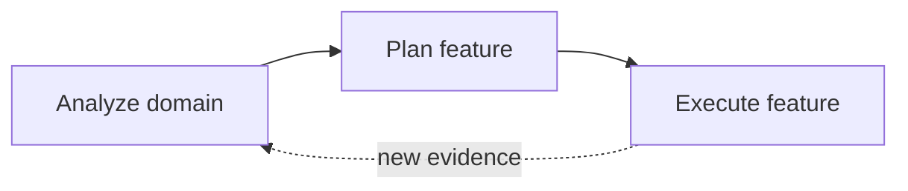
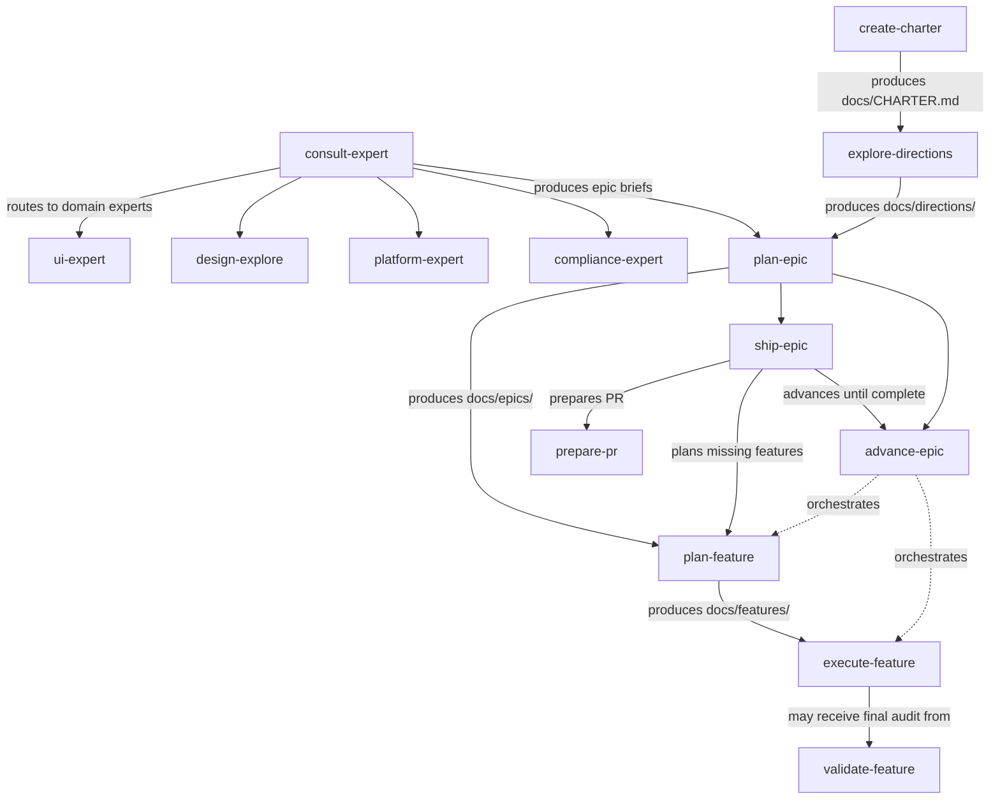
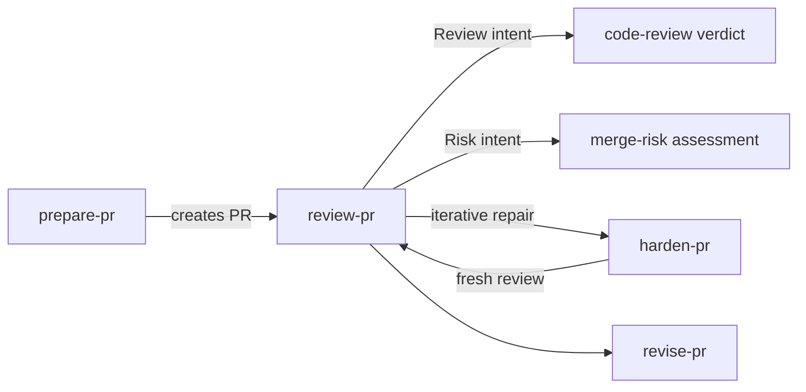
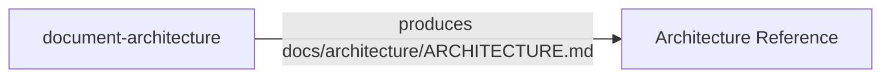
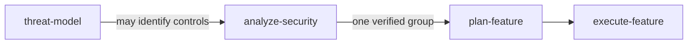
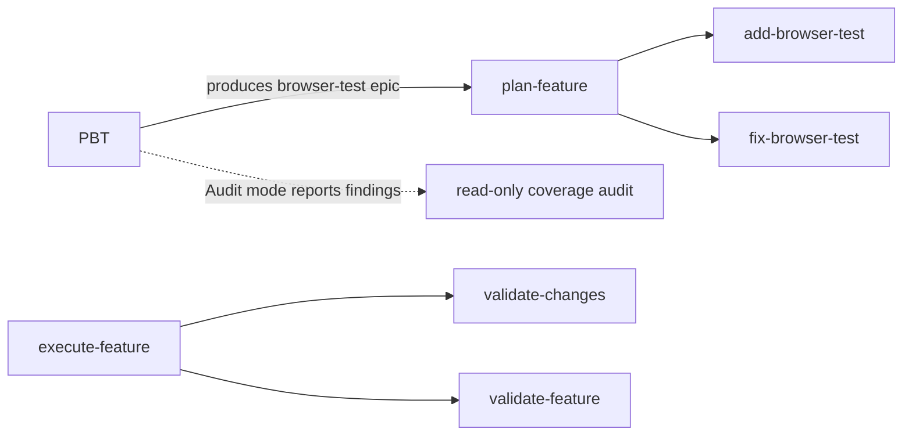
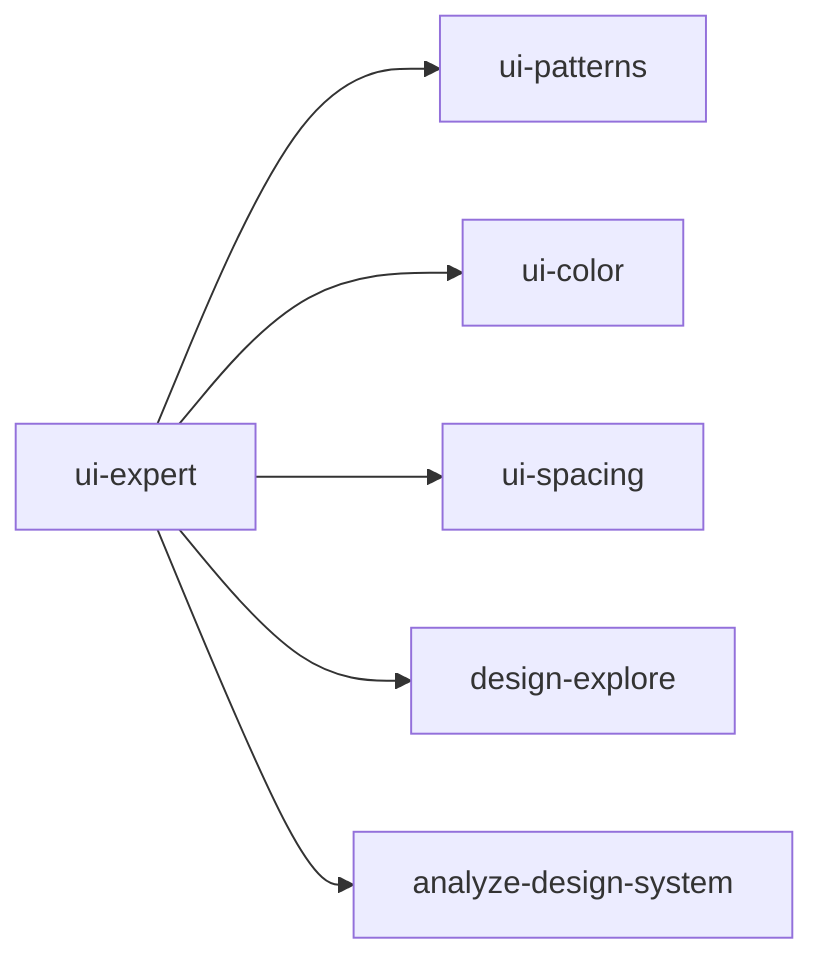
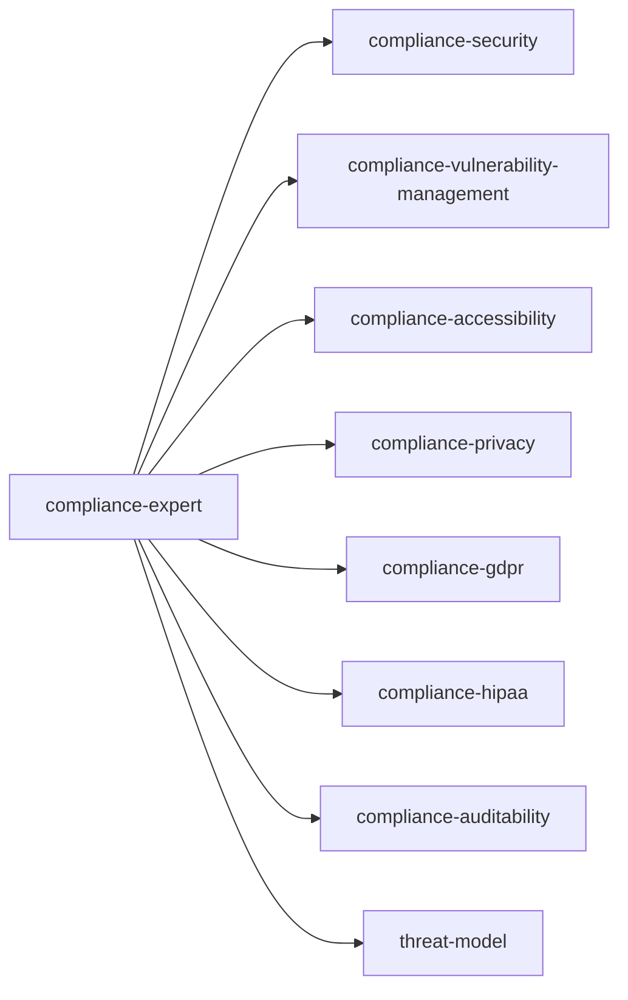
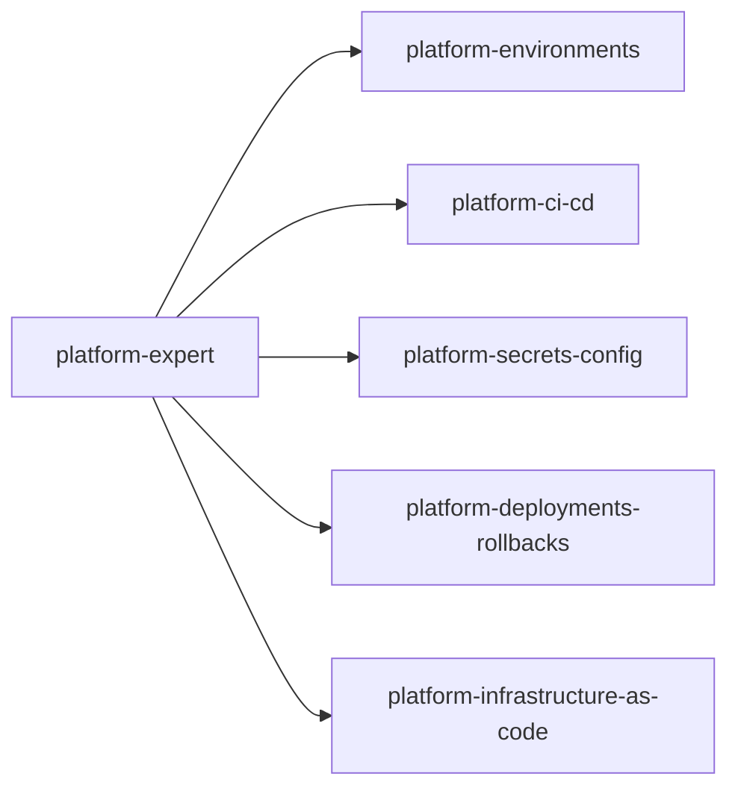

# Skills

This repository is a registry of agent skills. Each skill is a focused `SKILL.md` file that teaches an agent a workflow, convention, or domain-specific judgment pattern.

Use the registry by installing selected skills into the directory your agent client reads, then invoke the relevant skill by name or let the agent choose from the available skill descriptions. See [cli/README.md](cli/README.md) for installation and usage, and [AUTHORING.md](AUTHORING.md) for how to write or update skills.

## Repository Layout

This repository is a skills registry. Active source skills live under
`registry/`, and installers link or copy each selected skill package into the
directory an agent client reads. Archived packages live under `archive/` and
are not discoverable by the installer.

```text
skills/
  registry/
    <skill-name>/
      SKILL.md              # required skill instructions
      agents/
        openai.yaml         # optional agent/client metadata
      references/           # optional templates, examples, rubrics
      scripts/              # optional helper scripts invoked by the skill
      assets/               # optional supporting files
  archive/                  # deprecated packages retained for migration history
  catalog.json              # provenance policy and curated install profiles
  cli/                      # installer and registry tooling
  AUTHORING.md              # how to write and install skills
```

Claude-oriented installs commonly use these locations:

```text
~/.claude/skills/           # personal/global skills
<project>/.claude/skills/   # project-local shared skills
```

Codex or other clients may use analogous roots such as `~/.codex/skills/`, `~/.agents/skills/`, or `<project>/.codex/skills/` depending on client configuration. The registry source remains `registry/<skill-name>/`.

## Taxonomy

Classify a skill on four operational facets:

| Facet | Values | Why it matters |
| --- | --- | --- |
| **Kind** | router, workflow, reference | Determines the skill's expected structure |
| **Domain** | product, Git/PR, UI, design, React, Python, quality, compliance, platform, testing, and others | Controls installation and routing neighborhoods |
| **Stage** | analyze, plan, execute, review, preserve | Shows where the skill fits in a lifecycle |
| **Effect** | read-only, local files, local Git, network read, external write | Makes authorization and stopping points explicit |

Use **divergence** and **convergence** as optional product-thinking lenses, not
as the primary registry hierarchy. A planning skill may contain both; an
operational Git skill often fits neither.

`catalog.json` is the machine-readable source for curated install profiles and
external-source preservation policy. Skills not explicitly marked external are
registry-maintained. Externally sourced skill bodies are validated against their
origin commit and must be updated from upstream rather than edited locally.

Profiles may include other profiles. `core` intentionally stays small and
operational; install `advisory` when broad cross-domain routing is useful. The
advisory profile composes the maintained specialist profiles but deliberately
does not include externally sourced references. Install `linear-ops` for the
focused Linear issue and project creation workflows. Install
`skill-maintenance` only when curating a skill registry, and install
`external-creative` when explicitly opting into preserved third-party creative
references.

Routine convergence workflows use no more than three linear stages. Approval is
a gate between planning and execution, validation belongs inside execution, and
publication remains a separate delivery action. New evidence can send work back
to analysis or planning.


```mermaid
flowchart LR
    A["Analyze domain"] --> P["Plan feature"] --> E["Execute feature"]
    E -.->|"new evidence"| A
```

## Artifacts

Workflow skills create and consume artifacts inside the target project they are helping with. Durable planning artifacts live under a conventional `docs/` workspace.

Root-level all-caps docs are foundational or constitutional: they describe intent, principles, and operating methods. Derived docs that describe the current state of the codebase live under named subdirectories.

```text
<project>/
  docs/
    CHARTER.md                         # product north star
    METHODS.md                         # project methods, engineering principles, and operating approach
    PRESENTATION.md                    # product presentation, identity, voice, and visual direction
    architecture/
      ARCHITECTURE.md                  # derived current-state system architecture
    directions/
      NNN-<slug>.md                    # strategic options from explore-directions
    epics/
      NNN-<slug>.md                    # quarter-level epic plans
    features/
      NNN-<slug>.md                    # feature plans
      NNN-<slug>-validation.md         # validate-feature report
    security/
      threat-model-<scope>.md          # optional threat-model document
    tmp/
      wip-<name>.md                    # stash context breadcrumb when trackable
```

`docs/directions/`, `docs/epics/`, and `docs/features/` are the standard durable planning surfaces. Product programs and deliberately managed multi-feature initiatives flow through epics. Bounded refactors, security remediations, design-system consolidation, defect fixes, dependency work, and other convergence improvements may go directly from an `analyze-*` result to `plan-feature`; a parent epic is optional in Convergence mode. `docs/tmp/` is reserved for ephemeral WIP handoff notes.

## Workflow Skills

Workflow skills do work: they analyze a situation, produce planning artifacts, modify code, validate behavior, prepare delivery, or create pull requests.

### Product Direction And Delivery

Workflow skills for product direction, planning, cross-domain consultation, epic/feature delivery, and PR preparation.


```mermaid
flowchart TD
    CE[consult-expert] -->|routes to domain experts| UE[ui-expert]
    CE --> DE[design-explore]
    CE --> PL[platform-expert]
    CE --> CX[compliance-expert]
    CE -->|produces epic briefs| PE
    CC[create-charter] -->|produces docs/CHARTER.md| ED[explore-directions]
    ED -->|produces docs/directions/| PE[plan-epic]
    PE -->|produces docs/epics/| PF[plan-feature]
    PE --> SP[ship-epic]
    SP -->|plans missing features| PF
    SP -->|advances until complete| AE
    SP -->|prepares PR| PPR[prepare-pr]
    PF -->|produces docs/features/| EF[execute-feature]
    EF -->|may receive final audit from| VF[validate-feature]
    PE --> AE[advance-epic]
    AE -.->|orchestrates| PF
    AE -.->|orchestrates| EF
```

| Skill                                                  | Type     | Mode       | Phase   | Description                                                                                                                   |
| ------------------------------------------------------ | -------- | ---------- | ------- | ----------------------------------------------------------------------------------------------------------------------------- |
| [consult-expert](registry/consult-expert/SKILL.md)     | router | divergence | analyze, plan | Route broad product, engineering, backend, platform, quality, or compliance prompts to domain experts, synthesize recommendations, and produce epic briefs. |
| [explore-directions](registry/explore-directions/SKILL.md) | workflow | divergence | analyze | Analyze the product's current state and generate 3–5 distinct strategic directions with evidence and trade-offs for review. |
| [create-charter](registry/create-charter/SKILL.md)     | workflow | divergence | plan    | Create or refresh a product charter (CHARTER.md) that serves as the north star for all downstream planning.                   |
| [plan-epic](registry/plan-epic/SKILL.md)               | workflow | divergence | plan    | Create or update one charter-aligned epic, including deduplicating bug-bash or app-feedback observations into coherent child features. |
| [plan-feature](registry/plan-feature/SKILL.md)         | workflow | convergence | plan | Plan one bounded product feature or evidence-backed convergence improvement; parent epics are optional in Convergence mode. |
| [execute-feature](registry/execute-feature/SKILL.md)   | workflow | convergence | execute | Implement and verify one unchecked item from any product or convergence feature plan, create one local commit, and stop. |
| [advance-epic](registry/advance-epic/SKILL.md)         | workflow | convergence | execute | Advance an epic by planning and implementing its next incomplete child feature. Run repeatedly until the epic is complete.    |
| [ship-epic](registry/ship-epic/SKILL.md)               | workflow | convergence | execute | Complete an epic end-to-end — plan missing features, advance until all child features are complete, validate, and prepare a PR. |

### Linear Operations

Focused workflows for creating or polishing one verified Linear record and
stopping. Install the `linear-ops` profile when a team uses Linear.

| Skill | Type | Phase | Description |
| --- | --- | --- | --- |
| [create-issue](registry/create-issue/SKILL.md) | workflow | plan | Resolve live workspace fields, create one Linear issue, verify it, and stop. |
| [create-project](registry/create-project/SKILL.md) | workflow | plan | Resolve live workspace fields, create one Linear project, verify it, and stop. |
| [polish-issue](registry/polish-issue/SKILL.md) | workflow | edit | Improve an issue's language without changing its substance or properties. |

### Analysis Workflows

| Skill | Type | Phase | Description |
| --- | --- | --- | --- |
| [analyze-design-system](registry/analyze-design-system/SKILL.md) | workflow | analyze | Measure token, primitive, component-family, pattern, state, and migration convergence; rank bounded consolidation candidates without editing or planning. |
| [analyze-quality](registry/analyze-quality/SKILL.md) | workflow | analyze | Measure and interpret quality signals across maintainability, correctness, testing, and reliability; rank bounded feature candidates without editing or planning. |
| [analyze-security](registry/analyze-security/SKILL.md) | workflow | analyze | Verify and prioritize application-security posture gaps, dependency findings, and code-scanning findings without changing code or creating plans. |
| [diagnose-failure](registry/diagnose-failure/SKILL.md) | workflow | analyze | Reproduce and localize a software failure, rank hypotheses, and report an evidence-backed cause without editing the project. |

### Skill Registry Maintenance

| Skill | Type | Phase | Description |
| --- | --- | --- | --- |
| [ingest-skill](registry/ingest-skill/SKILL.md) | workflow | analyze, execute | Evaluate one externally created skill, then decline it, merge durable guidance into an existing maintained skill, create one new local skill, or recommend a separate commit-backed external preservation. |

Assess mode is read-only. Apply mode may merge or create locally maintained
skills, but never executes source-provided code, edits preserved packages,
commits, pushes, installs, or publishes.

### Git And PR Workflow


```mermaid
flowchart LR
    PP[prepare-pr] -->|creates PR| RP[review-pr]
    RP -->|Review intent| CR[code-review verdict]
    RP -->|Risk intent| RA[merge-risk assessment]
    RP -->|iterative repair| HP[harden-pr]
    HP -->|fresh review| RP
    RP --> RVP[revise-pr]
```

| Skill                                              | Type     | Mode        | Phase   | Description                                                                                                         |
| -------------------------------------------------- | -------- | ----------- | ------- | ------------------------------------------------------------------------------------------------------------------- |
| [stash](registry/stash/SKILL.md)                   | workflow | convergence | preserve | Preserve related in-progress work on a local `wip/` branch in one commit with a context note.                     |
| [harden-pr](registry/harden-pr/SKILL.md)           | workflow | convergence | execute, review | Iteratively alternate independent PR reviews with traceable fixes and validation until a bounded convergence or stop condition. |
| [prepare-pr](registry/prepare-pr/SKILL.md)         | workflow |             | execute | Prepare a pull request from a local branch — inspect changes, write a conventional commit, push, and open a PR.     |
| [polish-pr](registry/polish-pr/SKILL.md)           | workflow | convergence | edit | Improve a PR's language without changing its substance, template, or checklist state. |
| [revise-pr](registry/revise-pr/SKILL.md)           | workflow | convergence | execute | Revise an existing PR to ensure the title, description, and checklist accurately reflect the latest commits.        |
| [review-pr](registry/review-pr/SKILL.md)           | workflow |             | analyze, review | Review a pull request for actionable defects or assess operational and merge risk; post only when explicitly requested. |
| [trim-comments](registry/trim-comments/SKILL.md)   | workflow | convergence | edit | Trim low-value comments a branch's diff introduced — process narration, external ticket/plan references, restated-obvious lines — keeping durable rationale and tool directives. |

### Architecture Documentation


```mermaid
flowchart LR
    DA[document-architecture] -->|produces docs/architecture/ARCHITECTURE.md| AR[Architecture Reference]
```

| Skill                                                | Type     | Mode        | Phase   | Description                                                                                                                   |
| ---------------------------------------------------- | -------- | ----------- | ------- | ----------------------------------------------------------------------------------------------------------------------------- |
| [document-architecture](registry/document-architecture/SKILL.md) | workflow | convergence | analyze | Create or refresh derived `docs/architecture/ARCHITECTURE.md` from the codebase, including Mermaid diagrams for system context, runtime flows, boundaries, and data shape. |

### Security Analysis And Shared Delivery


```mermaid
flowchart LR
    TM[threat-model] -->|may identify controls| AS[analyze-security]
    AS -->|one verified group| PF1[plan-feature]
    PF1 --> EF1[execute-feature]
```

| Skill | Type | Mode | Phase | Description |
| --- | --- | --- | --- | --- |
| [threat-model](registry/threat-model/SKILL.md) | workflow | divergence | analyze, document | Map assets, actors, data flows, trust boundaries, abuse cases, controls, and residual risk; save a document only when requested. |
| [analyze-security](registry/analyze-security/SKILL.md) | workflow | convergence | analyze | Verify, normalize, group, and prioritize posture gaps, dependency advisories, and code-scanning findings. |
| [plan-feature](registry/plan-feature/SKILL.md) | workflow | convergence | plan | Record one verified remediation group with baseline, target, invariants, guardrails, and resolution evidence. |
| [execute-feature](registry/execute-feature/SKILL.md) | workflow | convergence | execute | Apply and verify one planned security item using conditionally loaded security safeguards, then commit locally and stop. |

### Testing Workflows


```mermaid
flowchart LR
    PBT -->|produces browser-test epic| PF2[plan-feature]
    PBT -.->|Audit mode reports findings| AUD[read-only coverage audit]
    PF2 --> ABT[add-browser-test]
    PF2 --> FBT[fix-browser-test]
    EF2[execute-feature] --> VC[validate-changes]
    EF2 --> VF2[validate-feature]
```

| Skill                                                                      | Type     | Mode        | Phase         | Description                                                                                                                                    |
| -------------------------------------------------------------------------- | -------- | ----------- | ------------- | ---------------------------------------------------------------------------------------------------------------------------------------------- |
| [plan-browser-tests](registry/plan-browser-tests/SKILL.md)                 | workflow | divergence  | analyze, plan | Plan critical UI coverage or audit the current browser suite; planning writes an epic, while audit is read-only unless an epic refresh is requested. |
| [add-browser-test](registry/add-browser-test/SKILL.md)                     | workflow | convergence | execute       | Implement one browser integration test from a planned browser-test feature, then verify and update the feature plan.                           |
| [fix-browser-test](registry/fix-browser-test/SKILL.md)                     | workflow | convergence | execute       | Repair one broken or flaky browser test from a test failure or planned browser-test feature.                                                   |
| [validate-changes](registry/validate-changes/SKILL.md)                     | workflow | convergence | execute       | Run targeted validation against recent code changes — maps diff to relevant tests, runs only those, and reports coverage gaps.                 |
| [validate-feature](registry/validate-feature/SKILL.md)                     | workflow | convergence | execute       | Comprehensive post-build validation — targeted tests, full browser suite, acceptance criteria verification, and structured ship/no-ship report. |

## Expert Routers And Reference Skills

Expert routers select and synthesize the smallest relevant specialist set.
Reference skills provide principles, patterns, conventions, and domain
judgment. Both guide agents while workflow skills perform planning,
implementation, validation, and delivery.

### Design Principles

Visual direction is **searched, not prescribed**. `design-explore` generates
several distinct directions, judges them against criteria derived from the
brief, and synthesizes a recommendation (generate-N-and-judge Workflow),
verified against ground truth (`ui-color` contrast, `ui-spacing` scale), and
`analyze-design-system` owns repository-wide convergence and pattern drift.

The prescriptive `design-*` references (composition, simplicity,
visual-language) were retired to `archive/design-evicted/`, and `visual-hierarchy`
followed to `archive/ui-evicted/` on 2026-08-17, after A/B evidence showed the base
model matches them on their own trigger prompts
(`evals/results/2026-08-15-design-retire.md`,
`evals/results/2026-08-17-ui-family.md`). They, and other legacy critique
workflows, are retained under `archive/` for history only — not discoverable or
installable.

| Skill                                                         | Type     | Description                                                                                                          |
| ------------------------------------------------------------- | -------- | -------------------------------------------------------------------------------------------------------------------- |
| [design-explore](registry/design-explore/SKILL.md)            | workflow | Generate several distinct visual directions, judge against explicit criteria, synthesize. Search over prescription.  |

### External Design References

These packages retain upstream bodies and are available through the
`external-creative` profile rather than the maintained `design` or `advisory`
profiles.

| Skill                                                | Type      | Description                                                                                                                                           | Origin                                                                                     |
| ---------------------------------------------------- | --------- | ----------------------------------------------------------------------------------------------------------------------------------------------------- | ------------------------------------------------------------------------------------------ |
| [svg-animations](registry/svg-animations/SKILL.md)   | reference | Create performant SVG animations and illustrations: path animations, shape morphing, loading spinners, animated logos, gradients, masks, and filters. | [supermemoryai](https://github.com/supermemoryai/skills/blob/main/svg-animations/SKILL.md) |
| [emil-design-eng](registry/emil-design-eng/SKILL.md) | reference | Design engineering philosophy — polished animations, thoughtful component design, and invisible details that make software feel great.                | [emilkowalski](https://github.com/emilkowalski/skill)                                      |

### UI Patterns

The `ui-*` prose family (layouts, forms, actions, feedback, content, typography,
icons, depth, responsive, onboarding, email) plus `visual-hierarchy` was evicted to
`archive/ui-evicted/` on 2026-08-17 after a family A/B showed the base model
produces equal-quality UI on those concerns unaided
(`evals/results/2026-08-17-ui-family.md`; 14 cases, gate PASS at A=0.913/B=0.905).
What remains is what the model can't derive or should verify: `ui-expert` (a thin
survivor index), `ui-patterns` (collection scale-completeness — the one skill with
a reproducible edge, converted to a slim objective), and the two runnable checkers
`ui-color` (WCAG contrast) and `ui-spacing` (scale conformance). Open visual
direction goes to `design-explore`; repository-wide drift to
`analyze-design-system`.


```mermaid
flowchart LR
    UX[ui-expert] --> P[ui-patterns]
    UX --> CL[ui-color]
    UX --> S[ui-spacing]
    UX --> DE[design-explore]
    UX --> ADS[analyze-design-system]
```

| Skill                                                | Type      | Description                                                                                                                                           |
| ---------------------------------------------------- | --------- | ----------------------------------------------------------------------------------------------------------------------------------------------------- |
| [ui-expert](registry/ui-expert/SKILL.md)             | router | Thin survivor index — routes to the few UI skills that still earn their keep and otherwise defers to base-model capability. |
| [ui-patterns](registry/ui-patterns/SKILL.md)         | reference | Collection objectives — match the container to the data, and the scale-completeness checklist (filter/search, pagination, density, empty/overflow) the model tends to omit. |
| [ui-color](registry/ui-color/SKILL.md)               | reference | Color-system objectives plus a runnable WCAG contrast check (`scripts/check_contrast.py`).                                                             |
| [ui-spacing](registry/ui-spacing/SKILL.md)           | reference | Spacing objectives plus a runnable scale-conformance lint (`scripts/check_spacing.py`).                                                                |

**References:** [components.build](https://www.components.build/) · [frontend-guidelines](https://github.com/bendc/frontend-guidelines)

### Quality

The `quality-*` interpretive family (clarity, modularity, refactoring,
correctness, testing, reliability) was retired to `archive/quality-evicted/`
after strict A/B evidence (`evals/results/2026-08-14-*`). What remains is the
part that scales: `analyze-quality` measures and ranks candidates, and the base
model interprets the signal. The cross-cutting method trio was resolved by A/B on
2026-08-17 (`evals/results/2026-08-17-cross-cutting-family.md`): `error-handling`
and `async-patterns` were evicted to `archive/cross-cutting-evicted/` (the base
model ties them with no residual failure mode), and `typescript-types` was
converted to an objective + check (see Core Language).

| Skill                                              | Type      | Purpose                                                            |
| -------------------------------------------------- | --------- | ----------------------------------------------------------------- |
| [analyze-quality](registry/analyze-quality/SKILL.md) | workflow | Read-only measurement and ranking of bounded quality candidates. |

### Compliance


```mermaid
flowchart LR
    CX[compliance-expert] --> CS[compliance-security]
    CX --> CVM[compliance-vulnerability-management]
    CX --> CA[compliance-accessibility]
    CX --> CP[compliance-privacy]
    CX --> CG[compliance-gdpr]
    CX --> CH[compliance-hipaa]
    CX --> CAT[compliance-auditability]
    CX --> TM[threat-model]
```

| Skill                                                                                      | Type      | Description                                                                                                                         |
| ------------------------------------------------------------------------------------------ | --------- | ----------------------------------------------------------------------------------------------------------------------------------- |
| [compliance-expert](registry/compliance-expert/SKILL.md)                                   | router | Router for security, vulnerability management, accessibility, privacy, GDPR, HIPAA, auditability, and external-risk work.           |
| [compliance-security](registry/compliance-security/SKILL.md)                               | reference | OWASP/NIST-anchored secure coding, auth/authz, injection, secrets, sessions, logging, supply chain, CI/CD, and secure defaults.     |
| [compliance-vulnerability-management](registry/compliance-vulnerability-management/SKILL.md) | reference | CVE and advisory triage, exploitability, remediation sequencing, patch risk, risk acceptance, and evidence.                         |
| [compliance-accessibility](registry/compliance-accessibility/SKILL.md)                     | reference | WCAG 2.2-oriented keyboard access, semantic structure, accessible names, focus order, contrast, forms, errors, and motion.          |
| [compliance-privacy](registry/compliance-privacy/SKILL.md)                                 | reference | General personal data classification, minimization, purpose limits, retention, deletion, logging, analytics, and third-party flows. |
| [compliance-gdpr](registry/compliance-gdpr/SKILL.md)                                       | reference | GDPR-specific principles, lawful basis, data subject rights, retention, breach escalation, DPIA triggers, and design/default.       |
| [compliance-hipaa](registry/compliance-hipaa/SKILL.md)                                     | reference | HIPAA-oriented ePHI, safeguards, access controls, audit controls, integrity, transmission security, risk review, and vendor review. |
| [compliance-auditability](registry/compliance-auditability/SKILL.md)                       | reference | Traceability, change records, approval evidence, audit logs, remediation proof, access records, and verifiable controls.            |
| [threat-model](registry/threat-model/SKILL.md)                                             | workflow  | Scoped assets, actors, trust boundaries, abuse cases, controls, verification, and residual-risk analysis.                           |

### Core Language

TypeScript type-safety as an objective plus the deterministic check that enforces
it. `error-handling` and `async-patterns` were evicted here on 2026-08-17 (the base
model covers failure contracts and async control flow natively); see Quality.

| Skill                                                        | Type      | Description                                                                                                                  |
| ------------------------------------------------------------ | --------- | ---------------------------------------------------------------------------------------------------------------------------- |
| [typescript-types](registry/typescript-types/SKILL.md)       | reference | Type-safety objectives (unrepresentable invalid states, no `any`/unsafe casts, derive-from-value, branded ids, exhaustiveness) enforced by `tsc --strict` + `@typescript-eslint/no-unsafe-*`. |

### Platform


```mermaid
flowchart LR
    PLX[platform-expert] --> PE[platform-environments]
    PLX --> PCD[platform-ci-cd]
    PLX --> PSC[platform-secrets-config]
    PLX --> PDR[platform-deployments-rollbacks]
    PLX --> PIAC[platform-infrastructure-as-code]
```

| Skill                                                                            | Type      | Description                                                                                                                       |
| -------------------------------------------------------------------------------- | --------- | --------------------------------------------------------------------------------------------------------------------------------- |
| [platform-expert](registry/platform-expert/SKILL.md)                             | router | Router for broad platform work - coordinates environment, CI/CD, secrets/config, deployment/rollback, and infrastructure-as-code guidance. |
| [platform-environments](registry/platform-environments/SKILL.md)                 | reference | Local, preview, staging, and production parity; backing services, runtime config, feature flags, promotion, and readiness.        |
| [platform-ci-cd](registry/platform-ci-cd/SKILL.md)                               | reference | Build/test/deploy pipelines, artifacts, workflow permissions, gates, provenance, supply-chain hardening, and release automation.  |
| [platform-secrets-config](registry/platform-secrets-config/SKILL.md)             | reference | Secrets, credentials, env vars, config schemas, secret stores, runtime injection, rotation, redaction, and leakage prevention.    |
| [platform-deployments-rollbacks](registry/platform-deployments-rollbacks/SKILL.md) | reference | Release strategy, canaries, blue/green, migration sequencing, health checks, smoke tests, rollback, roll-forward, and evidence.   |
| [platform-infrastructure-as-code](registry/platform-infrastructure-as-code/SKILL.md) | reference | Terraform/OpenTofu/Pulumi/CDK/Kubernetes manifests, modules, state, drift, plans, review, GitOps, and infra change safety.      |

### Backend

The `backend-*` family (API design, service boundaries, persistence, jobs,
integrations, auth) retired to `archive/backend-evicted/` after A/B evidence —
advice and code tasks — showed the base model matches it
(`evals/results/2026-08-14-rollout-backend.md`). Keep only genuine
org-specific guardrails as objectives; `docs/registry-rebalance-plan.md`
records the disposition.

### React

The `react-*` knowledge family (12 skills, ~2,497 lines) was retired to
`archive/react-pilot/` after the eviction pilot: an advice A/B and a code-gap
eval showed the bare model writes code with the same skill-taught properties
(`evals/results/2026-08-14-*`). The deterministic substitutes now do that
work: `eslint-plugin-react-hooks` (rules-of-hooks, exhaustive-deps),
`eslint-plugin-jsx-a11y`, React Testing Library conventions, and profiler
evidence — enforced by lint and tests, not prose.

### Python And FastAPI

The `python-*` + `fastapi-architecture` family was retired to
`archive/python-evicted/` under the same gate (rollout + extrapolation
confirmation, `evals/results/2026-08-14-*`). Tooling already enforces most of
its claims — `ruff` for lint/format, `mypy`/pyright for typing, `pytest` for
behavior, SqlAlchemy/async guardrails in code — so project config and CI
replace the prose.

## Other Skill Collections

| Collection                                                                     | Author     |
| ------------------------------------------------------------------------------ | ---------- |
| [andrej-karpathy-skills](https://github.com/multica-ai/andrej-karpathy-skills) | multica-ai |
| [agent-skills](https://github.com/addyosmani/agent-skills)                     | addyosmani |
| [skills](https://github.com/mattpocock/skills)                                 | mattpocock |
| [gstack](https://github.com/garrytan/gstack)                                   | garrytan   |
| [eng-practices](https://github.com/google/eng-practices)                       | google     |
