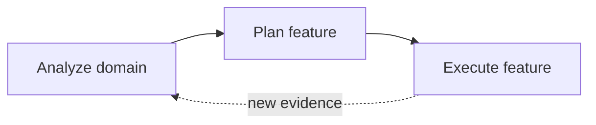
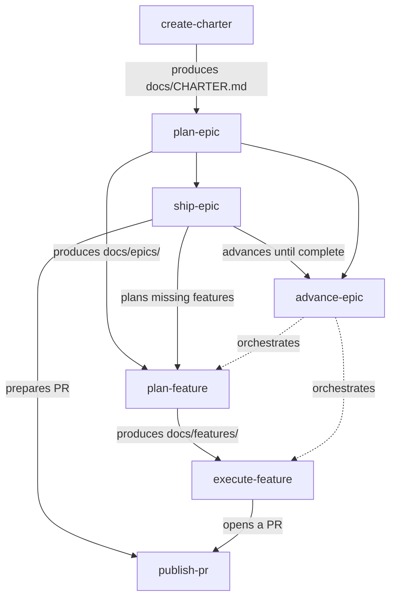
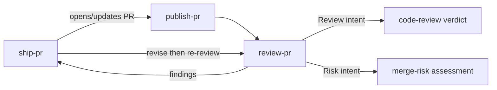

# Skills

This repository is a registry of agent skills. Each skill is a focused `SKILL.md` file that teaches an agent a workflow, convention, or domain-specific judgment pattern.

Use the registry by installing selected skills into the directory your agent client reads, then invoke the relevant skill by name or let the agent choose from the available skill descriptions. See [cli/README.md](cli/README.md) for installation and usage, and [AUTHORING.md](AUTHORING.md) for how to write or update skills.

## Repository Layout

This repository is a skills registry. Active source skills live under
`registry/`, and installers link or copy each selected skill package into the
directory an agent client reads. Archived packages live under `archive/` and
are not discoverable by the installer.

```text
skills/
  registry/
    <skill-name>/
      SKILL.md              # required skill instructions
      agents/
        openai.yaml         # optional agent/client metadata
      references/           # optional templates, examples, rubrics
      scripts/              # optional helper scripts invoked by the skill
      assets/               # optional supporting files
  archive/                  # deprecated packages retained for migration history
  catalog.json              # provenance policy and curated install profiles
  cli/                      # installer and registry tooling
  AUTHORING.md              # how to write and install skills
```

Claude-oriented installs commonly use these locations:

```text
~/.claude/skills/           # personal/global skills
<project>/.claude/skills/   # project-local shared skills
```

Codex or other clients may use analogous roots such as `~/.codex/skills/`, `~/.agents/skills/`, or `<project>/.codex/skills/` depending on client configuration. The registry source remains `registry/<skill-name>/`.

## Taxonomy

Classify a skill on four operational facets:

| Facet | Values | Why it matters |
| --- | --- | --- |
| **Kind** | operation, runbook, reference | Determines the skill's expected structure |
| **Domain** | product, Git/PR, Linear, UI, design, quality, security, testing, and others | Controls installation and routing neighborhoods |
| **Stage** | analyze, plan, execute, review, preserve | Shows where the skill fits in a lifecycle |
| **Effect** | read-only, local files, local Git, network read, external write | Makes authorization and stopping points explicit |

The three **Kind** values name three planes. An **operation** is a leaf verb: it
acts within one lifecycle phase, has one primary Effect, and stops at a gate. A
**runbook** composes operations across phases and owns the feedback loops between
them; it earns its place only by encoding control the base model would not
reliably infer — non-obvious gates, loop termination, durable state, recovery —
never by listing an obvious order. A **reference** is never invoked; it supplies
judgment a verb pulls in. (The earlier divergence/convergence lens is retired: it
never drove routing or installation.)

`catalog.json` is the machine-readable source for curated install profiles and
external-source preservation policy. Skills not explicitly marked external are
registry-maintained. Externally sourced skill bodies are validated against their
origin commit and must be updated from upstream rather than edited locally.

Profiles may include other profiles. `core` intentionally stays small and
operational; install `advisory` when broad cross-domain reference is useful. The
advisory profile composes the maintained reference profiles but deliberately
does not include externally sourced references. Install `linear-ops` for the
focused Linear issue and project creation workflows. Install
`external-creative` when explicitly opting into preserved third-party creative
references.

A routine operation uses no more than three linear phases. Approval is
a gate between planning and execution, validation belongs inside execution, and
publication remains a separate delivery action. New evidence can send work back
to an earlier phase — the feedback edges a runbook owns.


```mermaid
flowchart LR
    A["Analyze domain"] --> P["Plan feature"] --> E["Execute feature"]
    E -.->|"new evidence"| A
```

## Artifacts

Workflow skills create and consume artifacts inside the target project they are helping with. Durable planning artifacts live under a conventional `docs/` workspace.

Root-level all-caps docs are foundational or constitutional: they describe intent, principles, and operating methods. Derived docs that describe the current state of the codebase live under named subdirectories.

```text
<project>/
  docs/
    CHARTER.md                         # product north star
    METHODS.md                         # project methods, engineering principles, and operating approach
    PRESENTATION.md                    # product presentation, identity, voice, and visual direction
    epics/
      NNN-<slug>.md                    # quarter-level epic plans
    features/
      NNN-<slug>.md                    # feature plans
    tmp/
      wip-<name>.md                    # stash context breadcrumb when trackable
```

`docs/epics/` and `docs/features/` are the standard durable planning surfaces. Product programs and deliberately managed multi-feature initiatives flow through epics. Bounded refactors, security remediations, design-system consolidation, defect fixes, dependency work, and other convergence improvements may go directly from analysis evidence to `plan-feature`; a parent epic is optional in Convergence mode. `docs/tmp/` is reserved for ephemeral WIP handoff notes.

## Workflow Skills

Workflow skills do work: they analyze a situation, produce planning artifacts, modify code, validate behavior, prepare delivery, or create pull requests. Each is either an **operation** — a leaf verb acting in one lifecycle phase — or a **runbook** that composes operations and owns the loops between them (`advance-epic`, `ship-epic`, `ship-pr`).

### Product Direction And Delivery

Workflow skills for product direction, planning, epic/feature delivery, and PR preparation.


```mermaid
flowchart TD
    CC[create-charter] -->|produces docs/CHARTER.md| PE[plan-epic]
    PE -->|produces docs/epics/| PF[plan-feature]
    PE --> SP[ship-epic]
    SP -->|plans missing features| PF
    SP -->|advances until complete| AE
    SP -->|prepares PR| PPR[publish-pr]
    PF -->|produces docs/features/| EF[execute-feature]
    EF -->|opens a PR| PPR
    PE --> AE[advance-epic]
    AE -.->|orchestrates| PF
    AE -.->|orchestrates| EF
```

| Skill | Type | Phase | Description |
| --- | --- | --- | --- |
| [create-charter](registry/create-charter/SKILL.md) | operation | plan | Create or refresh a product charter (CHARTER.md) that serves as the north star for all downstream planning. |
| [plan-epic](registry/plan-epic/SKILL.md) | operation | plan | Create or update one charter-aligned epic, including deduplicating bug-bash or app-feedback observations into coherent child features. |
| [plan-feature](registry/plan-feature/SKILL.md) | operation | plan | Plan one bounded product feature or evidence-backed convergence improvement; parent epics are optional in Convergence mode. |
| [execute-feature](registry/execute-feature/SKILL.md) | operation | execute | Implement and verify one unchecked item from any product or convergence feature plan, create one local commit, and stop. |
| [advance-epic](registry/advance-epic/SKILL.md) | runbook | execute | Advance an epic by planning and implementing its next incomplete child feature. Run repeatedly until the epic is complete. |
| [ship-epic](registry/ship-epic/SKILL.md) | runbook | execute | Complete an epic end-to-end — plan missing features, advance until all child features are complete, validate, and prepare a PR. |

### Linear Operations

Focused workflows for creating or polishing one verified Linear record and
stopping. Install the `linear-ops` profile when a team uses Linear.

| Skill | Type | Phase | Description |
| --- | --- | --- | --- |
| [create-issue](registry/create-issue/SKILL.md) | operation | plan | Resolve live workspace fields, create one Linear issue, verify it, and stop. |
| [create-project](registry/create-project/SKILL.md) | operation | plan | Resolve live workspace fields, create one Linear project, verify it, and stop. |
| [polish-issue](registry/polish-issue/SKILL.md) | operation | edit | Improve an issue's language without changing its substance or properties. |

Analysis ("what to change"), diagnosis ("why it fails"), and verification ("does it
pass") are base-model capabilities the model performs inline while working; `review-pr`
assesses the resulting pull request. None is a separate skill.

### Git And PR Workflow


```mermaid
flowchart LR
    SPR[ship-pr] -->|opens/updates PR| PUB[publish-pr]
    PUB --> RP[review-pr]
    RP -->|Review intent| CR[code-review verdict]
    RP -->|Risk intent| RA[merge-risk assessment]
    RP -->|findings| SPR
    SPR -->|revise then re-review| RP
```

| Skill | Type | Phase | Description |
| --- | --- | --- | --- |
| [stash](registry/stash/SKILL.md) | operation | preserve | Preserve related in-progress work on a local `wip/` branch in one commit with a context note. |
| [publish-pr](registry/publish-pr/SKILL.md) | operation | execute, edit | Take a branch to a pull request (branch, commit, push, open), or update an existing PR's title and body (sync to the diff, or polish); detects which is needed and forks. Each effect separately authorized. |
| [review-pr](registry/review-pr/SKILL.md) | operation | analyze, review | Review a pull request for actionable defects or assess operational and merge risk; post only when explicitly requested. |
| [ship-pr](registry/ship-pr/SKILL.md) | runbook | execute, review | Drive one change through its whole lifecycle to a merge-ready PR — build, verify, publish, then model-diverse review→revise→verify rounds until it converges or hits a bounded stop. Stops before merge. |
| [address-review](registry/address-review/SKILL.md) | operation | execute, review | Triage inbound reviewer comments — fix, reply, defer, or fold into another PR — then implement, reply to threads, and resolve; gates the push that could dismiss an approval. |
| [rebase-pr](registry/rebase-pr/SKILL.md) | operation | execute | Rebase one or more PR branches onto their base (default staging), reconcile changes upstream already made, then optionally force-push and re-review. |
| [trim-comments](registry/trim-comments/SKILL.md) | operation | edit | Trim low-value comments a branch's diff introduced — process narration, external ticket/plan references, restated-obvious lines — keeping durable rationale and tool directives. |

### Organization-Specific

Skills scoped to specific organization repositories, installed via the `mindsdb`
profile and not part of the generic registry.

| Skill | Type | Phase | Description |
| --- | --- | --- | --- |
| [mindsdb-migrate-surface-to-tailwind](registry/mindsdb-migrate-surface-to-tailwind/SKILL.md) | operation | execute | Migrate one MindsHub Cowork UI surface's inline styles to Tailwind and design tokens as three separately-committed passes on a draft PR. |
| [mindsdb-track-design-system-metrics](registry/mindsdb-track-design-system-metrics/SKILL.md) | operation | analyze | Measure design-system convergence metrics for a configured scope and post one weekly progress comment to a Linear tracking issue. |

## Reference Skills

Reference skills provide objectives, conventions, and runnable checks the base
model should apply or verify against, rather than method prose it can already
produce. The former `*-expert` routers were evicted once the base model routed
among the focused skills as well without them; consult the skills directly.

### Design

Visual direction is **searched, not prescribed**. `design-explore` generates
several distinct directions, judges them against criteria derived from the brief,
and synthesizes a recommendation, verified against ground truth (`ui-color`
contrast, `ui-spacing` scale). Repository-wide design-system convergence and pattern
drift are base-model analysis.

| Skill                                                         | Type     | Description                                                                                                          |
| ------------------------------------------------------------- | -------- | -------------------------------------------------------------------------------------------------------------------- |
| [design-explore](registry/design-explore/SKILL.md)            | operation | Generate several distinct visual directions, judge against explicit criteria, synthesize. Search over prescription.  |

### UI

The prose UI family was evicted; what remains is what the model can't derive or
should verify — a collection scale-completeness objective and two runnable checkers.

| Skill                                                | Type      | Description                                                                                                                                           |
| ---------------------------------------------------- | --------- | ----------------------------------------------------------------------------------------------------------------------------------------------------- |
| [ui-patterns](registry/ui-patterns/SKILL.md)         | reference | Collection objectives — match the container to the data, and the scale-completeness checklist (filter/search, pagination, density, empty/overflow) the model tends to omit. |
| [ui-color](registry/ui-color/SKILL.md)               | reference | Color-system objectives plus a runnable WCAG contrast check (`scripts/check_contrast.py`).                                                             |
| [ui-spacing](registry/ui-spacing/SKILL.md)           | reference | Spacing objectives plus a runnable scale-conformance lint (`scripts/check_spacing.py`).                                                                |

### Core Language

| Skill                                                        | Type      | Description                                                                                                                  |
| ------------------------------------------------------------ | --------- | ---------------------------------------------------------------------------------------------------------------------------- |
| [typescript-types](registry/typescript-types/SKILL.md)       | reference | Type-safety objectives (unrepresentable invalid states, no `any`/unsafe casts, derive-from-value, branded ids, exhaustiveness) enforced by `tsc --strict` + `@typescript-eslint/no-unsafe-*`. |

### Shared Conventions

Kernel skills other skills reference for a consistent PR standard and house prose
voice.

| Skill                                                        | Type      | Description                                                                                                                  |
| ------------------------------------------------------------ | --------- | ---------------------------------------------------------------------------------------------------------------------------- |
| [pr-conventions](registry/pr-conventions/SKILL.md)           | reference | The shared PR standard — description shape, conventional commits, GitHub interaction mechanics, and the code-review finding model. |
| [writing-conventions](registry/writing-conventions/SKILL.md) | reference | Shared prose conventions for the concise, human technical writing across PRs, issues, plans, and commit messages. |

### External Design References

These packages retain upstream bodies and are available through the
`external-creative` profile rather than the maintained `design` or `advisory`
profiles.

| Skill                                                | Type      | Description                                                                                                                                           | Origin                                                                                     |
| ---------------------------------------------------- | --------- | ----------------------------------------------------------------------------------------------------------------------------------------------------- | ------------------------------------------------------------------------------------------ |
| [svg-animations](registry/svg-animations/SKILL.md)   | reference | Create performant SVG animations and illustrations: path animations, shape morphing, loading spinners, animated logos, gradients, masks, and filters. | [supermemoryai](https://github.com/supermemoryai/skills/blob/main/svg-animations/SKILL.md) |
| [emil-design-eng](registry/emil-design-eng/SKILL.md) | reference | Design engineering philosophy — polished animations, thoughtful component design, and invisible details that make software feel great.                | [emilkowalski](https://github.com/emilkowalski/skill)                                      |

## Other Skill Collections

| Collection                                                                     | Author     |
| ------------------------------------------------------------------------------ | ---------- |
| [andrej-karpathy-skills](https://github.com/multica-ai/andrej-karpathy-skills) | multica-ai |
| [agent-skills](https://github.com/addyosmani/agent-skills)                     | addyosmani |
| [skills](https://github.com/mattpocock/skills)                                 | mattpocock |
| [gstack](https://github.com/garrytan/gstack)                                   | garrytan   |
| [eng-practices](https://github.com/google/eng-practices)                       | google     |
