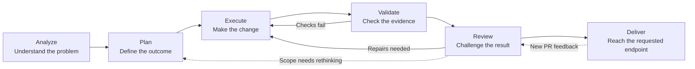

# Skills

A registry built around **one unit of work: one independently reviewable outcome, normally one PR**. The general set has **17 skills**: six operations, three orchestration skills, five runbooks, and three compact references. Two optional organization packages are kept separately.

The base model supplies general reasoning and technique. Skills earn their place through house contracts, corrective objectives, fragile mechanics, or useful verification; the six operations do not prescribe how to think.

The agent owns an ordinary task. Operations are capabilities, not mandatory steps or approval gates. Existing issues and feature plans remain valid work records. An initiative coordinates several units, normally several PRs.

Read [the shared work contract](registry/work-conventions/SKILL.md), [authoring rules](AUTHORING.md), and [the complete migration map](docs/registry-rebuild.md). Installation commands are in [cli/README.md](cli/README.md).

## How a unit of work moves

The forward path shows a typical change. The return arrows show how evidence and feedback lead to another pass.

```mermaid
flowchart LR
    A["Analyze<br/>Understand the problem"] --> P["Plan<br/>Define the outcome"]
    P --> E["Execute<br/>Make the change"]
    E --> V["Validate<br/>Check the evidence"]
    V --> R["Review<br/>Challenge the result"]
    R --> D["Deliver<br/>Reach the requested endpoint"]
    V -->|Checks fail| E
    R -->|Repairs needed| E
    R -.->|Scope needs rethinking| P
    D -.->|New PR feedback| R
```

**Enter where the work needs you.** A clear bug fix can begin at Execute; an existing PR can begin at Review. Skip results already established, reuse current evidence, and stop at the endpoint the user requested. Delivery may mean local changes, a commit, an open PR, or an explicitly requested merge; it does not imply all of them.

One work record carries intent, acceptance, progress, and evidence through these loops. An existing issue or feature plan is enough; a small uninterrupted task may need only the task's context.

## Where each kind of skill fits

| Kind | What it contributes | Example |
| --- | --- | --- |
| **Operation** | A result within one unit of work | Validate the current change against its acceptance criteria |
| **Runbook** | Specific mechanics an operation or user can invoke directly | Publish a PR or create a Linear issue |
| **Reference** | Shared conventions or focused knowledge | The house standard for PR descriptions |
| **Orchestration** | Coordination across several units of work | Plan an epic's dependencies and advance its ready units |

### Operations — one unit of work

| Skill | Question it answers |
| --- | --- |
| [analyze-work](registry/analyze-work/SKILL.md) | What is happening, and what evidence matters? |
| [plan-work](registry/plan-work/SKILL.md) | What outcome are we committing to, and how will we prove it? |
| [execute-work](registry/execute-work/SKILL.md) | What change satisfies that outcome? |
| [validate-work](registry/validate-work/SKILL.md) | Which requirements does this candidate demonstrably meet? |
| [review-work](registry/review-work/SKILL.md) | What defects, scope gaps, or delivery risks remain? |
| [deliver-work](registry/deliver-work/SKILL.md) | Has the work reached the requested endpoint? |

### Orchestration — several units of work

| Skill | Responsibility |
| --- | --- |
| [shape-initiative](registry/shape-initiative/SKILL.md) | Clarify direction and strategic intent |
| [plan-epic](registry/plan-epic/SKILL.md) | Divide the initiative into work units and dependencies |
| [ship-epic](registry/ship-epic/SKILL.md) | Advance ready units and verify the combined outcome |

Each child unit uses the operations above. Independent units can advance while another is blocked; the initiative still needs its own integration evidence.

### Runbooks — specific procedures

| Skill | Responsibility |
| --- | --- |
| [publish-pr](registry/publish-pr/SKILL.md) | Commit, push, create or update a PR |
| [rebase-pr](registry/rebase-pr/SKILL.md) | Reconcile a branch with its moving integration base |
| [preserve-work](registry/preserve-work/SKILL.md) | Preserve a recoverable local WIP snapshot |
| [create-issue](registry/create-issue/SKILL.md) | Create one verified Linear issue |
| [create-project](registry/create-project/SKILL.md) | Create one verified Linear project |

### References — shared conventions

| Skill | Responsibility |
| --- | --- |
| [work-conventions](registry/work-conventions/SKILL.md) | Scope, continuation, records, and evidence |
| [pr-conventions](registry/pr-conventions/SKILL.md) | PR content and review findings |
| [writing-conventions](registry/writing-conventions/SKILL.md) | Shared prose preferences |

## Installation profiles

Choose **`general`** for the complete general registry, or **`core`** for the six operations and their required supporting packages. More focused profiles are available below.

| Profile | Purpose |
| --- | --- |
| `core` | Six work operations with their required contracts and PR mechanics. |
| `orchestration` | Shape, plan, and deliver initiatives across work units. |
| `runbooks` | GitHub, Linear, and recoverable work-preservation procedures. |
| `general` | The seventeen general skills, including operations, orchestration, runbooks, and references. |
| `linear-ops` | Create one verified Linear issue or project. |
| `mindsdb` | Optional organization-specific inventory and migration tools. |

Required package dependencies are installed transitively for profiles and individual selections. Optional skill recommendations do not expand installations. `core` includes six operations plus required shared contracts and PR mechanics. `general` includes all seventeen general packages, excluding optional packages.

Optional packages: `mindsdb-migrate-surface-to-tailwind` and `mindsdb-track-design-system-metrics`.

## Layout and migration

Active packages live in `registry/<name>/`; conditional references and tools travel with their owner. `catalog.json` is the source for layer, scope, effects, dependencies, resources, profiles, and provenance. `archive/` is historical and is not installable.

Against the reconciled main registry, the rebuild retires fourteen entry points and adds nine, taking the active registry from 24 to 19 packages. Previous archive families and evaluation evidence remain intact. See the migration map before replacing an installed profile. Existing client copies and retired symlinks are not automatically removed; inspect and migrate them explicitly, preserving local customizations. No permanent alias skills are installed.

Historical retention plans and scorecards remain under docs/ and evals/results as evidence of earlier decisions. They are not the current architecture or quality verdict. See [evals/README.md](evals/README.md) for current behavioral evaluation and its limits.
