# Skills

This repository is a registry of agent skills. Each skill is a focused `SKILL.md` file that teaches an agent a workflow, convention, or domain-specific judgment pattern.

Use the registry by installing selected skills into the directory your agent client reads, then invoke the relevant skill by name or let the agent choose from the available skill descriptions. See [cli/README.md](cli/README.md) for installation and usage, and [AUTHORING.md](AUTHORING.md) for how to write or update skills.

## Repository Layout

This repository is a skills registry. Active source skills live under
`registry/`, and installers link or copy each selected skill package into the
directory an agent client reads. Archived packages live under `archive/` and
are not discoverable by the installer.

```text
skills/
  registry/
    <skill-name>/
      SKILL.md              # required skill instructions
      agents/
        openai.yaml         # optional agent/client metadata
      references/           # optional templates, examples, rubrics
      scripts/              # optional helper scripts invoked by the skill
      assets/               # optional supporting files
  archive/                  # deprecated packages retained for migration history
  cli/                      # installer and registry tooling
  AUTHORING.md              # how to write and install skills
```

Claude-oriented installs commonly use these locations:

```text
~/.claude/skills/           # personal/global skills
<project>/.claude/skills/   # project-local shared skills
```

Codex or other clients may use analogous roots such as `~/.codex/skills/`, `~/.agents/skills/`, or `<project>/.codex/skills/` depending on client configuration. The registry source remains `registry/<skill-name>/`.

## Taxonomy

Classify a skill on four operational facets:

| Facet | Values | Why it matters |
| --- | --- | --- |
| **Kind** | router, workflow, reference | Determines the skill's expected structure |
| **Domain** | product, Git/PR, UI, design, React, Python, quality, compliance, platform, testing, and others | Controls installation and routing neighborhoods |
| **Stage** | discover, decide, plan, implement, validate, review, ship, preserve | Shows where the skill fits in a lifecycle |
| **Effect** | read-only, local files, local Git, network read, external write | Makes authorization and stopping points explicit |

Use **divergence** and **convergence** as optional product-thinking lenses, not
as the primary registry hierarchy. A planning skill may contain both; an
operational Git skill often fits neither.

Most workflow skills move through the same broad lifecycle. New evidence,
blockers, or review feedback can send work back to discovery or planning.

```mermaid
flowchart LR
flowchart LR
    D["Discover / decide"] --> P["Plan"] --> I["Implement"] --> V["Validate / review"] --> S["Ship / preserve"]
    V -.->|"new evidence"| D
```

## Artifacts

Workflow skills create and consume artifacts inside the target project they are helping with. Durable planning artifacts live under a conventional `docs/` workspace.

Root-level all-caps docs are foundational or constitutional: they describe intent, principles, and operating methods. Derived docs that describe the current state of the codebase live under named subdirectories.

```text
<project>/
  docs/
    CHARTER.md                         # product north star
    METHODS.md                         # project methods, engineering principles, and operating approach
    PRESENTATION.md                    # product presentation, identity, voice, and visual direction
    architecture/
      ARCHITECTURE.md                  # derived current-state system architecture
    directions/
      NNN-<slug>.md                    # strategic options from explore-directions
    epics/
      NNN-<slug>.md                    # quarter-level epic plans
      NNN-<slug>-audit.md              # audit-epic findings
      NNN-<slug>-gap-closure.md        # plan-epic-gaps punch list
    features/
      NNN-<slug>.md                    # feature plans
      NNN-<slug>-validation.md         # validate-feature report
    tmp/
      session-YYYY-MM-DD-<slug>.md     # saved session notes
      wip-<name>.md                    # stash context breadcrumb when trackable
```

`docs/directions/`, `docs/epics/`, and `docs/features/` are the standard durable planning surfaces. Projects, refactors, bug bashes, browser-test coverage, component-structure work, security remediation, platform work, and internal quality initiatives should still flow through epics and features rather than separate top-level planning directories or `docs/tmp` queues. `docs/tmp/` is reserved for ephemeral session breadcrumbs and WIP handoff notes.

## Workflow Skills

Workflow skills do work: they analyze a situation, produce planning artifacts, modify code, validate behavior, prepare delivery, or create pull requests.

### Product Direction And Delivery

Workflow skills for product direction, planning, cross-domain consultation, epic/feature delivery, and PR preparation.

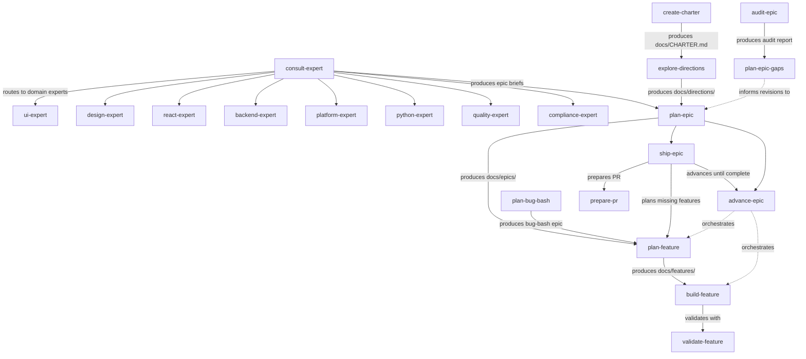
```mermaid
flowchart TD
    CE[consult-expert] -->|routes to domain experts| UE[ui-expert]
    CE --> DX[design-expert]
    CE --> RE[react-expert]
    CE --> BE[backend-expert]
    CE --> PL[platform-expert]
    CE --> PY[python-expert]
    CE --> QE[quality-expert]
    CE --> CX[compliance-expert]
    CE -->|produces epic briefs| PE
    CC[create-charter] -->|produces docs/CHARTER.md| ED[explore-directions]
    ED -->|produces docs/directions/| PE[plan-epic]
    PE -->|produces docs/epics/| PF[plan-feature]
    PBB[plan-bug-bash] -->|produces bug-bash epic| PF
    PE --> SP[ship-epic]
    SP -->|plans missing features| PF
    SP -->|advances until complete| AE
    SP -->|prepares PR| PPR[prepare-pr]
    PF -->|produces docs/features/| BF[build-feature]
    BF -->|validates with| VF[validate-feature]
    PE --> AE[advance-epic]
    AE -.->|orchestrates| PF
    AE -.->|orchestrates| BF
    AE2[audit-epic] -->|produces audit report| PEG[plan-epic-gaps]
    PEG -.->|informs revisions to| PE
```

| Skill                                                  | Type     | Mode       | Phase   | Description                                                                                                                   |
| ------------------------------------------------------ | -------- | ---------- | ------- | ----------------------------------------------------------------------------------------------------------------------------- |
| [consult-expert](registry/consult-expert/SKILL.md)     | workflow | divergence | analyze, plan | Route broad product, engineering, backend, platform, quality, or compliance prompts to domain experts, synthesize recommendations, and produce epic briefs. |
| [explore-directions](registry/explore-directions/SKILL.md) | workflow | divergence | analyze | Analyze the product's current state and generate 3–5 distinct strategic directions with evidence and trade-offs for review. |
| [create-charter](registry/create-charter/SKILL.md)     | workflow | divergence | plan    | Create or refresh a product charter (CHARTER.md) that serves as the north star for all downstream planning.                   |
| [plan-epic](registry/plan-epic/SKILL.md)               | workflow | divergence | plan    | Create a structured epic plan that translates a product charter into a quarter-level initiative.                              |
| [plan-bug-bash](registry/plan-bug-bash/SKILL.md)       | workflow | divergence | analyze, plan | Turn stream-of-consciousness bug observations into a standard bug-bash epic with prioritized child features.            |
| [plan-feature](registry/plan-feature/SKILL.md)         | workflow | convergence | plan | Create a structured feature plan that defines a 1–2 week deliverable and links it to a parent epic.                           |
| [build-feature](registry/build-feature/SKILL.md)       | workflow | convergence | execute | Implement one acceptance criterion from a feature plan — write code, verify, commit, and check it off. Run repeatedly until the feature is complete. |
| [advance-epic](registry/advance-epic/SKILL.md)         | workflow | convergence | execute | Advance an epic by planning and implementing its next incomplete child feature. Run repeatedly until the epic is complete.    |
| [ship-epic](registry/ship-epic/SKILL.md)               | workflow | convergence | execute | Complete an epic end-to-end — plan missing features, advance until all child features are complete, validate, and prepare a PR. |
| [audit-epic](registry/audit-epic/SKILL.md)             | workflow | convergence | analyze | Audit an epic to find missing, inconsistent, or incomplete child features — cross-references feature plans against the epic and reports gaps. |
| [plan-epic-gaps](registry/plan-epic-gaps/SKILL.md)     | workflow | convergence | plan    | Create a prioritized plan to close gaps found by audit-epic — maps each gap to a concrete action and produces a structured punch list.        |

### Git And PR Workflow

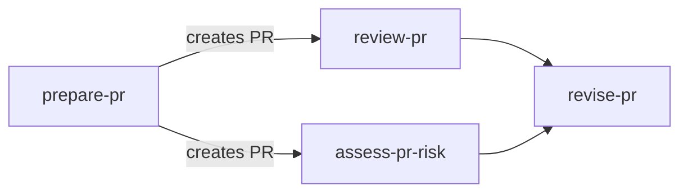
```mermaid
flowchart LR
    PP[prepare-pr] -->|creates PR| RP[review-pr]
    PP -->|creates PR| APR[assess-pr-risk]
    RP --> RVP[revise-pr]
    APR --> RVP
```

| Skill                                              | Type     | Mode        | Phase   | Description                                                                                                         |
| -------------------------------------------------- | -------- | ----------- | ------- | ------------------------------------------------------------------------------------------------------------------- |
| [stash](registry/stash/SKILL.md)                   | workflow | convergence | preserve | Preserve related in-progress work on a local `wip/` branch in one commit with a context note.                     |
| [save-session](registry/save-session/SKILL.md)     | workflow |             | analyze | Summarize the current working session and save it to `docs/tmp/`.                                                   |
| [prepare-pr](registry/prepare-pr/SKILL.md)         | workflow |             | execute | Prepare a pull request from a local branch — inspect changes, write a conventional commit, push, and open a PR.     |
| [revise-pr](registry/revise-pr/SKILL.md)           | workflow | convergence | execute | Revise an existing PR to ensure the title, description, and checklist accurately reflect the latest commits.        |
| [review-pr](registry/review-pr/SKILL.md)           | workflow |             | analyze | Review a pull request and post inline code review comments with an overall verdict.                                 |
| [assess-pr-risk](registry/assess-pr-risk/SKILL.md) | workflow |             | analyze | Assess the risk level of a pull request across blast radius, security sensitivity, test coverage, and dependencies. |

### Architecture Documentation

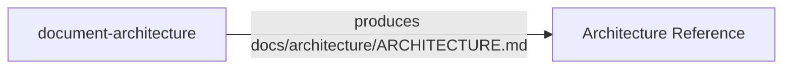
```mermaid
flowchart LR
    DA[document-architecture] -->|produces docs/architecture/ARCHITECTURE.md| AR[Architecture Reference]
```

| Skill                                                | Type     | Mode        | Phase   | Description                                                                                                                   |
| ---------------------------------------------------- | -------- | ----------- | ------- | ----------------------------------------------------------------------------------------------------------------------------- |
| [document-architecture](registry/document-architecture/SKILL.md) | workflow | convergence | analyze | Create or refresh derived `docs/architecture/ARCHITECTURE.md` from the codebase, including Mermaid diagrams for system context, runtime flows, boundaries, and data shape. |

### Security Remediation Workflows

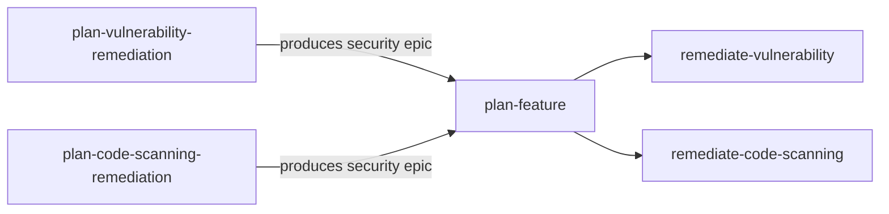
```mermaid
flowchart LR
    PVR[plan-vulnerability-remediation] -->|produces security epic| PF1[plan-feature]
    PCSR[plan-code-scanning-remediation] -->|produces security epic| PF1
    PF1 --> RV[remediate-vulnerability]
    PF1 --> RCS[remediate-code-scanning]
```

| Skill                                                                              | Type     | Mode        | Phase         | Description                                                                                                  |
| ---------------------------------------------------------------------------------- | -------- | ----------- | ------------- | ------------------------------------------------------------------------------------------------------------ |
| [plan-vulnerability-remediation](registry/plan-vulnerability-remediation/SKILL.md) | workflow | convergence | analyze, plan | Triage CVEs, Dependabot alerts, and audit findings into a standard vulnerability remediation epic.           |
| [remediate-vulnerability](registry/remediate-vulnerability/SKILL.md)               | workflow | convergence | execute       | Execute one planned dependency vulnerability remediation feature, verify the fix, commit, push, and open a PR. |
| [plan-code-scanning-remediation](registry/plan-code-scanning-remediation/SKILL.md) | workflow | convergence | analyze, plan | Triage CodeQL and SAST alerts into a standard code-scanning remediation epic.                                |
| [remediate-code-scanning](registry/remediate-code-scanning/SKILL.md)               | workflow | convergence | execute       | Execute one planned CodeQL/SAST remediation feature, verify the fix, and create or update a pull request.    |

### Testing Workflows

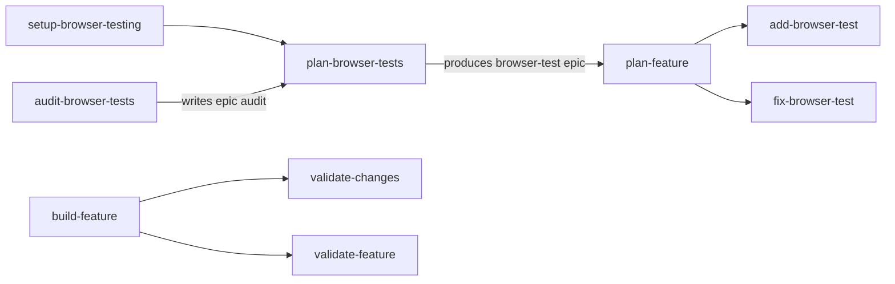
```mermaid
flowchart LR
    SBT[setup-browser-testing] --> PBT[plan-browser-tests]
    PBT -->|produces browser-test epic| PF2[plan-feature]
    ABT2[audit-browser-tests] -->|writes epic audit| PBT
    PF2 --> ABT[add-browser-test]
    PF2 --> FBT[fix-browser-test]
    BF2[build-feature] --> VC[validate-changes]
    BF2 --> VF2[validate-feature]
```

| Skill                                                                      | Type     | Mode        | Phase         | Description                                                                                                                                    |
| -------------------------------------------------------------------------- | -------- | ----------- | ------------- | ---------------------------------------------------------------------------------------------------------------------------------------------- |
| [setup-browser-testing](registry/setup-browser-testing/SKILL.md)           | workflow | convergence | execute       | Set up the browser testing facility — installs and configures framework, auth helpers, CI workflow with scheduled runs, and conventions docs.  |
| [plan-browser-tests](registry/plan-browser-tests/SKILL.md)                 | workflow | divergence  | analyze, plan | Analyze critical UI flows and produce a standard browser-test coverage epic with child features.                                               |
| [add-browser-test](registry/add-browser-test/SKILL.md)                     | workflow | convergence | execute       | Implement one browser integration test from a planned browser-test feature, then verify and update the feature plan.                           |
| [audit-browser-tests](registry/audit-browser-tests/SKILL.md)               | workflow | convergence | analyze       | Audit an existing browser test suite, write an epic audit, and update the browser-test coverage epic.                                          |
| [fix-browser-test](registry/fix-browser-test/SKILL.md)                     | workflow | convergence | execute       | Repair one broken or flaky browser test from a test failure or planned browser-test feature.                                                   |
| [validate-changes](registry/validate-changes/SKILL.md)                     | workflow | convergence | execute       | Run targeted validation against recent code changes — maps diff to relevant tests, runs only those, and reports coverage gaps.                 |
| [validate-feature](registry/validate-feature/SKILL.md)                     | workflow | convergence | execute       | Comprehensive post-build validation — targeted tests, full browser suite, acceptance criteria verification, and structured ship/no-ship report. |

## Reference Skills

Reference skills provide principles, patterns, conventions, and domain judgment. They guide agents while workflow skills perform the actual planning, implementation, validation, and delivery.

### Design Principles

Reference skills for turning a functional interface into something clearer, calmer, more elegant, and more visually coherent. Use `design-expert` for broad visual quality work or when the right focused design skill is unclear.

Legacy design-system and critique workflows are retained under `archive/` for
migration history. They are not discoverable or installable. The active design
taxonomy uses the `design-expert` router and focused `design-*` references.

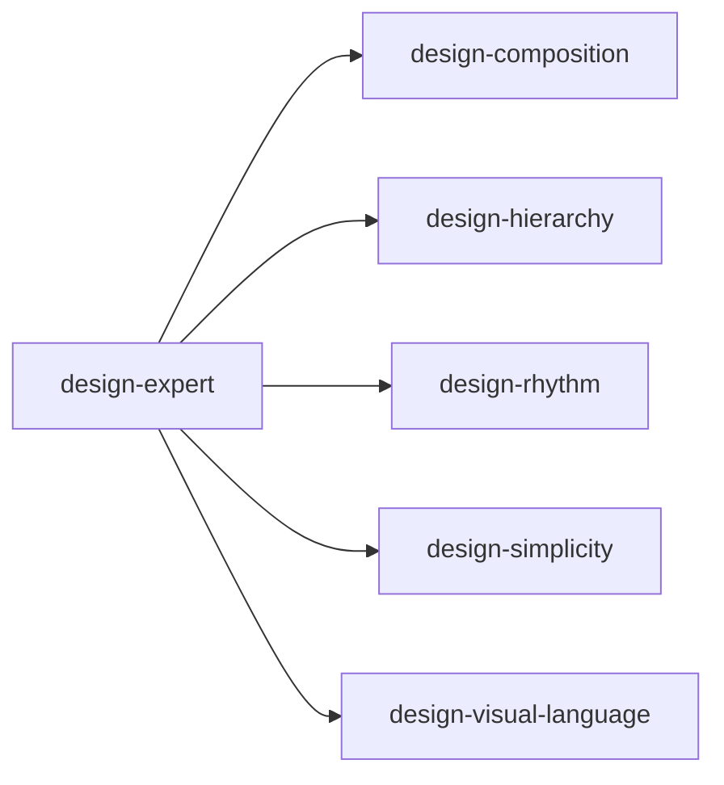
```mermaid
flowchart LR
    DX[design-expert] --> DC[design-composition]
    DX --> DH[design-hierarchy]
    DX --> DR[design-rhythm]
    DX --> DS[design-simplicity]
    DX --> DVL[design-visual-language]
```

| Skill                                                | Type      | Description                                                                                                                                           |
| ---------------------------------------------------- | --------- | ----------------------------------------------------------------------------------------------------------------------------------------------------- |
| [design-expert](registry/design-expert/SKILL.md)     | reference | Router for visual design judgment - coordinates focused `design-*` skills for composition, hierarchy, rhythm, simplicity, and visual language.        |
| [design-composition](registry/design-composition/SKILL.md) | reference | Composition principles - balance, alignment, proportion, focal point, spatial structure, grouping, figure-ground, and visual weight.                  |
| [design-hierarchy](registry/design-hierarchy/SKILL.md) | reference | Visual hierarchy principles - dominance, emphasis, contrast, de-emphasis, foreground/background, and calm visual priority.                            |
| [design-rhythm](registry/design-rhythm/SKILL.md)     | reference | Rhythm principles - cadence, repetition, variation, whitespace, density flow, and visual tempo.                                                       |
| [design-simplicity](registry/design-simplicity/SKILL.md) | reference | Simplicity principles - restraint, reduction, decluttering, focus, and reducing visual/cognitive load without removing needed capability.             |
| [design-visual-language](registry/design-visual-language/SKILL.md) | reference | Visual language principles - aesthetic direction, mood, personality, cohesion, materiality, brand fit, and avoiding generic or mismatched styling.    |

### Design References

| Skill                                                | Type      | Description                                                                                                                                           | Origin                                                                                     |
| ---------------------------------------------------- | --------- | ----------------------------------------------------------------------------------------------------------------------------------------------------- | ------------------------------------------------------------------------------------------ |
| [svg-animations](registry/svg-animations/SKILL.md)   | reference | Create performant SVG animations and illustrations: path animations, shape morphing, loading spinners, animated logos, gradients, masks, and filters. | [supermemoryai](https://github.com/supermemoryai/skills/blob/main/svg-animations/SKILL.md) |
| [color-expert](registry/color-expert/SKILL.md)       | reference | Color science expert — color theory, accessibility standards, palette generation, and practical color tools.                                          | [meodai](https://github.com/meodai/skill.color-expert)                                     |
| [emil-design-eng](registry/emil-design-eng/SKILL.md) | reference | Design engineering philosophy — polished animations, thoughtful component design, and invisible details that make software feel great.                | [emilkowalski](https://github.com/emilkowalski/skill)                                      |
| [animation-vocabulary](registry/animation-vocabulary/SKILL.md) | reference | Glossary of animation patterns and terminology — entrances, exits, easing, springs, scroll effects, feedback interactions, and performance concepts. | [emilkowalski](https://animations.dev/vocabulary) |

### UI Patterns

Reference skills for selecting the right UI patterns based on data density, task complexity, and user goals. Use `ui-expert` for broad page/app work or when the right focused skill is unclear; invoke individual skills for specific decisions.

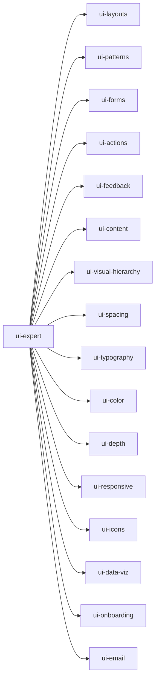
```mermaid
flowchart LR
    UX[ui-expert] --> L[ui-layouts]
    UX --> P[ui-patterns]
    UX --> F[ui-forms]
    UX --> A[ui-actions]
    UX --> FB[ui-feedback]
    UX --> C[ui-content]
    UX --> VH[ui-visual-hierarchy]
    UX --> S[ui-spacing]
    UX --> T[ui-typography]
    UX --> CL[ui-color]
    UX --> D[ui-depth]
    UX --> R[ui-responsive]
    UX --> I[ui-icons]
    UX --> DV[ui-data-viz]
    UX --> O[ui-onboarding]
    UX --> E[ui-email]
```

| Skill                                                | Type      | Description                                                                                                                                           |
| ---------------------------------------------------- | --------- | ----------------------------------------------------------------------------------------------------------------------------------------------------- |
| [ui-expert](registry/ui-expert/SKILL.md)             | reference | Router for broad UI work — coordinates the focused `ui-*` skills and prevents overlap across layout, patterns, forms, actions, states, surfaces, and visual system decisions. |
| [ui-layouts](registry/ui-layouts/SKILL.md)           | reference | Page-level layout patterns — app shell, page chrome, content zoning, standard page archetypes, scroll behavior, and responsive layout adaptation.      |
| [ui-patterns](registry/ui-patterns/SKILL.md)         | reference | Data display patterns — tables vs cards vs lists, pagination, search/filter placement, detail views, navigation, tabs vs accordions, content organization. |
| [ui-forms](registry/ui-forms/SKILL.md)               | reference | Form patterns — container selection (modal vs drawer vs page), field type heuristics, wizard design, settings page organization.                      |
| [ui-feedback](registry/ui-feedback/SKILL.md)         | reference | Feedback patterns — empty states, loading states (skeleton vs spinner vs optimistic), error handling, toast vs banner vs modal alerts, confirmation vs undo. |
| [ui-actions](registry/ui-actions/SKILL.md)           | reference | Action affordances — row actions (inline vs overflow), bulk operations, hover vs static visibility, keyboard shortcuts, drag-and-drop, mobile touch adaptations. |
| [ui-content](registry/ui-content/SKILL.md)           | reference | UX writing and microcopy — button labels, empty states, errors, field help, terminology, confirmations, success messages, and tone.                    |
| [ui-visual-hierarchy](registry/ui-visual-hierarchy/SKILL.md) | reference | Visual hierarchy — size, weight, color, position, chunking, progressive disclosure, scanning patterns, and action hierarchy.                 |
| [ui-spacing](registry/ui-spacing/SKILL.md)           | reference | Spacing and proximity — spacing scale, density, negative space, rhythm, and context-specific spacing for forms, tables, cards, lists, and pages.      |
| [ui-typography](registry/ui-typography/SKILL.md)     | reference | Typography — type scales, font choices, line length, heading hierarchy, contrast, numeric figures, and context-specific text treatment.               |
| [ui-color](registry/ui-color/SKILL.md)               | reference | Color systems — palettes, semantic tokens, neutral scales, dark mode, contrast, status colors, and brand color selection.                              |
| [ui-depth](registry/ui-depth/SKILL.md)               | reference | Depth and media treatment — elevation, shadows, layered surfaces, overlays, inset controls, image crops, text over images, and user-uploaded media.    |
| [ui-responsive](registry/ui-responsive/SKILL.md)     | reference | Responsive design — breakpoints, stack/reduce/reorganize/off-canvas patterns, touch targets, navigation adaptation, images, and testing widths.       |
| [ui-icons](registry/ui-icons/SKILL.md)               | reference | Icon usage — when to use icons, label pairing, sizing, accessible icon buttons, library selection, consistency, color, and animation.                 |
| [ui-data-viz](registry/ui-data-viz/SKILL.md)         | reference | Data visualization — chart type selection, number-vs-chart decisions, dashboard cards, data-ink ratio, chart color, and time-series guidance.         |
| [ui-onboarding](registry/ui-onboarding/SKILL.md)     | reference | Onboarding — first-run experiences, sample data, checklists, progressive discovery, tours, activation moments, and re-onboarding.                     |
| [ui-email](registry/ui-email/SKILL.md)               | reference | Email UI patterns — transactional, digest, report, product update, and lifecycle email layouts with real email-client constraints.                    |

**References:** [components.build](https://www.components.build/) · [frontend-guidelines](https://github.com/bendc/frontend-guidelines)

### Quality

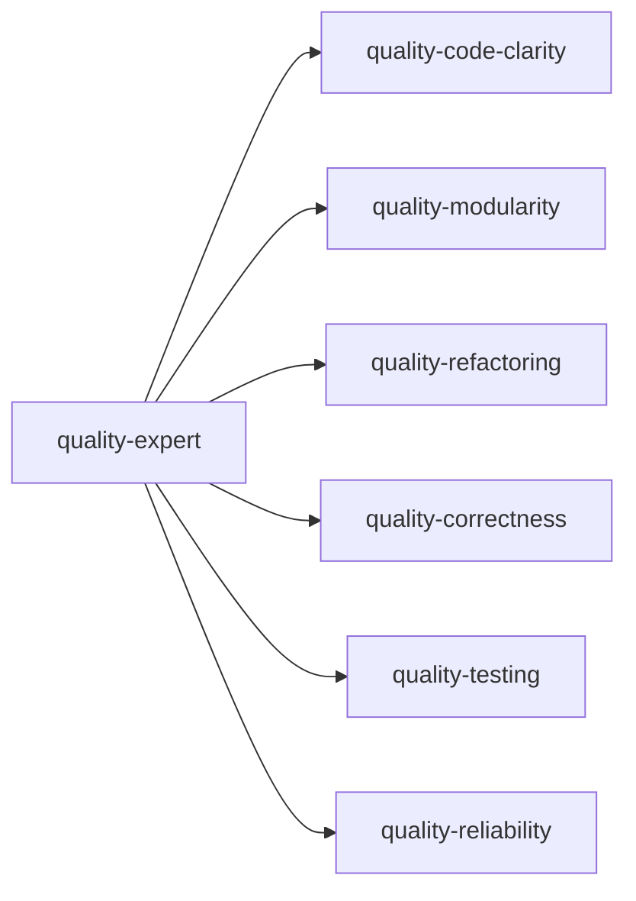
```mermaid
flowchart LR
    QX[quality-expert] --> QCC[quality-code-clarity]
    QX --> QM[quality-modularity]
    QX --> QR[quality-refactoring]
    QX --> QC[quality-correctness]
    QX --> QT[quality-testing]
    QX --> QREL[quality-reliability]
```

| Skill                                                              | Type      | Description                                                                                                                  |
| ------------------------------------------------------------------ | --------- | ---------------------------------------------------------------------------------------------------------------------------- |
| [quality-expert](registry/quality-expert/SKILL.md)                 | reference | Router for broad code quality work - coordinates clarity, modularity, refactoring, correctness, testing, and reliability.    |
| [quality-code-clarity](registry/quality-code-clarity/SKILL.md)     | reference | Naming, readability, local reasoning, intention-revealing code, control flow, comments, and removal of cleverness.          |
| [quality-modularity](registry/quality-modularity/SKILL.md)         | reference | Cohesion, coupling, responsibility boundaries, dependency direction, abstractions, module seams, and change isolation.       |
| [quality-refactoring](registry/quality-refactoring/SKILL.md)       | reference | Code smells, safe incremental transformations, behavior preservation, cleanup sequencing, and validation of refactors.       |
| [quality-correctness](registry/quality-correctness/SKILL.md)       | reference | Invariants, edge cases, boundary validation, data integrity, idempotency, concurrency hazards, and behavioral truth.         |
| [quality-testing](registry/quality-testing/SKILL.md)               | reference | Language-agnostic testing strategy, test ROI, test levels, regression confidence, test smells, and flakiness.               |
| [quality-reliability](registry/quality-reliability/SKILL.md)       | reference | Failure modes, timeouts, retries, graceful degradation, observability, backpressure, recovery, and operational confidence.  |

### Compliance

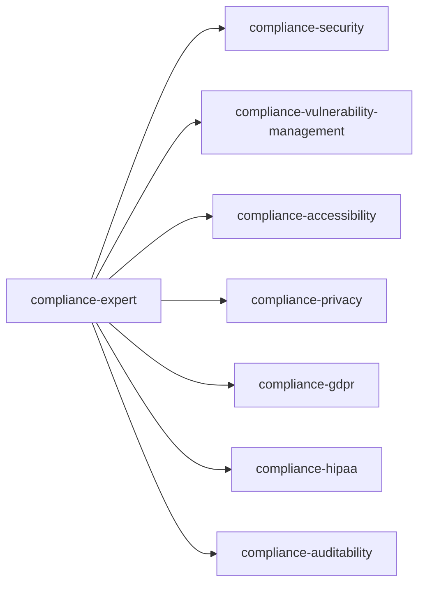
```mermaid
flowchart LR
    CX[compliance-expert] --> CS[compliance-security]
    CX --> CVM[compliance-vulnerability-management]
    CX --> CA[compliance-accessibility]
    CX --> CP[compliance-privacy]
    CX --> CG[compliance-gdpr]
    CX --> CH[compliance-hipaa]
    CX --> CAT[compliance-auditability]
```

| Skill                                                                                      | Type      | Description                                                                                                                         |
| ------------------------------------------------------------------------------------------ | --------- | ----------------------------------------------------------------------------------------------------------------------------------- |
| [compliance-expert](registry/compliance-expert/SKILL.md)                                   | reference | Router for security, vulnerability management, accessibility, privacy, GDPR, HIPAA, auditability, and external-risk work.           |
| [compliance-security](registry/compliance-security/SKILL.md)                               | reference | OWASP/NIST-anchored secure coding, auth/authz, injection, secrets, sessions, logging, supply chain, CI/CD, and secure defaults.     |
| [compliance-vulnerability-management](registry/compliance-vulnerability-management/SKILL.md) | reference | CVE and advisory triage, exploitability, remediation sequencing, patch risk, risk acceptance, and evidence.                         |
| [compliance-accessibility](registry/compliance-accessibility/SKILL.md)                     | reference | WCAG 2.2-oriented keyboard access, semantic structure, accessible names, focus order, contrast, forms, errors, and motion.          |
| [compliance-privacy](registry/compliance-privacy/SKILL.md)                                 | reference | General personal data classification, minimization, purpose limits, retention, deletion, logging, analytics, and third-party flows. |
| [compliance-gdpr](registry/compliance-gdpr/SKILL.md)                                       | reference | GDPR-specific principles, lawful basis, data subject rights, retention, breach escalation, DPIA triggers, and design/default.       |
| [compliance-hipaa](registry/compliance-hipaa/SKILL.md)                                     | reference | HIPAA-oriented ePHI, safeguards, access controls, audit controls, integrity, transmission security, risk review, and vendor review. |
| [compliance-auditability](registry/compliance-auditability/SKILL.md)                       | reference | Traceability, change records, approval evidence, audit logs, remediation proof, access records, and verifiable controls.            |

### Core Language

TypeScript and JavaScript best practices — reference skills that inform how code is written across the stack.

| Skill                                                        | Type      | Description                                                                                                                  |
| ------------------------------------------------------------ | --------- | ---------------------------------------------------------------------------------------------------------------------------- |
| [functional-patterns](registry/functional-patterns/SKILL.md) | reference | Immutability, pure functions, array methods over imperative loops, composition over inheritance, avoiding side effects.      |
| [typescript-types](registry/typescript-types/SKILL.md)       | reference | No `any`, discriminated unions, type narrowing, `satisfies`, branded types, deriving types from values.                      |
| [error-handling](registry/error-handling/SKILL.md)           | reference | Error as values (Result types), typed errors, throw for exceptional cases only, catch at system boundaries.                  |
| [async-patterns](registry/async-patterns/SKILL.md)           | reference | async/await over raw promises, `Promise.all` for concurrency, AbortController, race condition guards, limiting concurrency.  |

### Platform

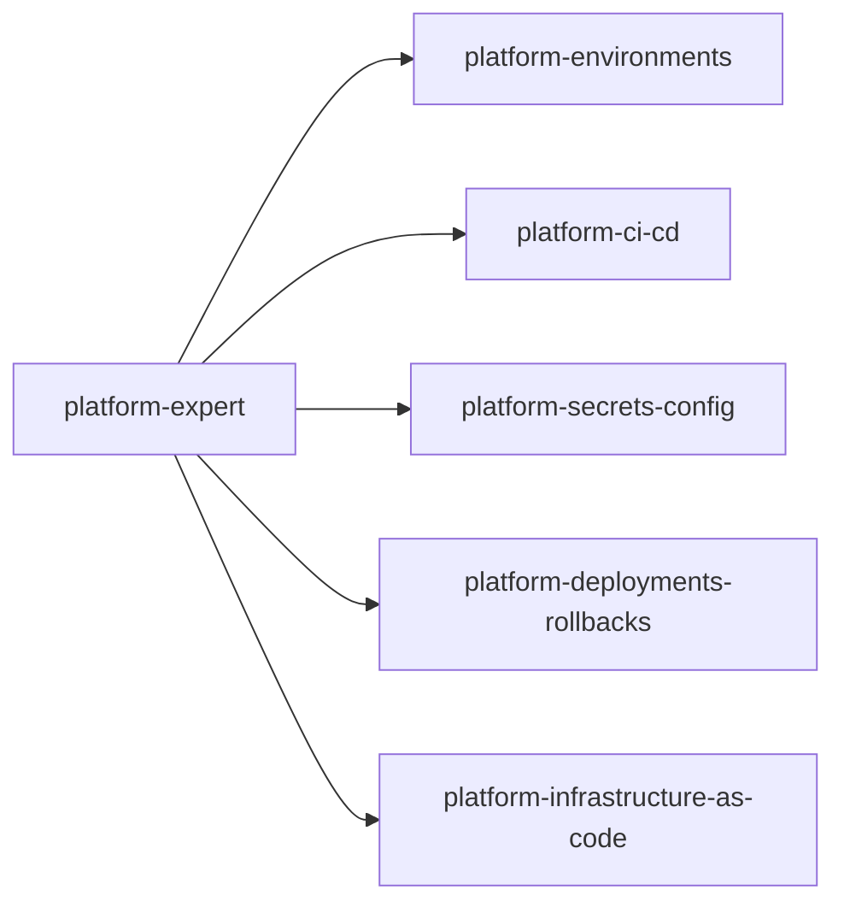
```mermaid
flowchart LR
    PLX[platform-expert] --> PE[platform-environments]
    PLX --> PCD[platform-ci-cd]
    PLX --> PSC[platform-secrets-config]
    PLX --> PDR[platform-deployments-rollbacks]
    PLX --> PIAC[platform-infrastructure-as-code]
```

| Skill                                                                            | Type      | Description                                                                                                                       |
| -------------------------------------------------------------------------------- | --------- | --------------------------------------------------------------------------------------------------------------------------------- |
| [platform-expert](registry/platform-expert/SKILL.md)                             | reference | Router for broad platform work - coordinates environment, CI/CD, secrets/config, deployment/rollback, and infrastructure-as-code guidance. |
| [platform-environments](registry/platform-environments/SKILL.md)                 | reference | Local, preview, staging, and production parity; backing services, runtime config, feature flags, promotion, and readiness.        |
| [platform-ci-cd](registry/platform-ci-cd/SKILL.md)                               | reference | Build/test/deploy pipelines, artifacts, workflow permissions, gates, provenance, supply-chain hardening, and release automation.  |
| [platform-secrets-config](registry/platform-secrets-config/SKILL.md)             | reference | Secrets, credentials, env vars, config schemas, secret stores, runtime injection, rotation, redaction, and leakage prevention.    |
| [platform-deployments-rollbacks](registry/platform-deployments-rollbacks/SKILL.md) | reference | Release strategy, canaries, blue/green, migration sequencing, health checks, smoke tests, rollback, roll-forward, and evidence.   |
| [platform-infrastructure-as-code](registry/platform-infrastructure-as-code/SKILL.md) | reference | Terraform/OpenTofu/Pulumi/CDK/Kubernetes manifests, modules, state, drift, plans, review, GitOps, and infra change safety.      |

### Backend

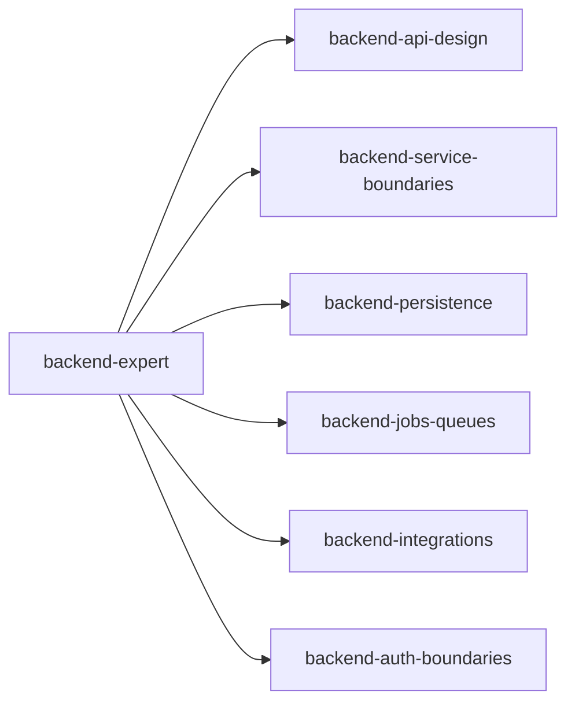
```mermaid
flowchart LR
    BX[backend-expert] --> BAD[backend-api-design]
    BX --> BSB[backend-service-boundaries]
    BX --> BP[backend-persistence]
    BX --> BJQ[backend-jobs-queues]
    BX --> BI[backend-integrations]
    BX --> BAB[backend-auth-boundaries]
```

| Skill                                                                    | Type      | Description                                                                                                                              |
| ------------------------------------------------------------------------ | --------- | ---------------------------------------------------------------------------------------------------------------------------------------- |
| [backend-expert](registry/backend-expert/SKILL.md)                       | reference | Router for broad backend work - coordinates focused server-side skills across APIs, service boundaries, persistence, jobs, integrations, and auth boundaries. |
| [backend-api-design](registry/backend-api-design/SKILL.md)               | reference | API contracts, resource modeling, request/response shapes, validation, errors, pagination, filtering, versioning, and idempotency.       |
| [backend-service-boundaries](registry/backend-service-boundaries/SKILL.md) | reference | Server-side ownership for handlers, services, use cases, domain behavior, transaction placement, dependency direction, and side effects. |
| [backend-persistence](registry/backend-persistence/SKILL.md)             | reference | Data modeling, migrations, transactions, consistency, repositories, query boundaries, indexing, retention, and safe schema evolution.    |
| [backend-jobs-queues](registry/backend-jobs-queues/SKILL.md)             | reference | Background jobs, queues, schedules, retries, idempotency, dead-letter handling, concurrency, backpressure, and observability.            |
| [backend-integrations](registry/backend-integrations/SKILL.md)           | reference | Third-party APIs, webhooks, external clients, sync flows, provider rate limits, outbox/inbox patterns, and partial failure handling.     |
| [backend-auth-boundaries](registry/backend-auth-boundaries/SKILL.md)     | reference | Authentication and authorization placement, identity propagation, tenant isolation, sessions, tokens, permission checks, and access tests. |

### React SPA

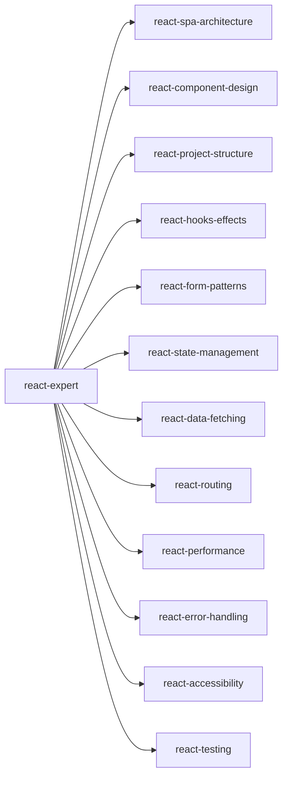
```mermaid
flowchart LR
    RX[react-expert] --> RSA[react-spa-architecture]
    RX --> RCD[react-component-design]
    RX --> RPS[react-project-structure]
    RX --> RHE[react-hooks-effects]
    RX --> RFP[react-form-patterns]
    RX --> RSM[react-state-management]
    RX --> RDF[react-data-fetching]
    RX --> RR[react-routing]
    RX --> RP[react-performance]
    RX --> REH[react-error-handling]
    RX --> RA[react-accessibility]
    RX --> RT[react-testing]
```

| Skill                                                                | Type      | Description                                                                                                                                |
| -------------------------------------------------------------------- | --------- | ------------------------------------------------------------------------------------------------------------------------------------------ |
| [react-expert](registry/react-expert/SKILL.md)                       | reference | Router for broad React work - coordinates focused React skills across architecture, components, hooks, forms, state, data, routing, performance, errors, accessibility, and tests. |
| [react-component-design](registry/react-component-design/SKILL.md)   | reference | Component size, single responsibility, compositional patterns, and "branch early" — prefer distinct components over prop-toggled behavior. |
| [react-project-structure](registry/react-project-structure/SKILL.md) | reference | Base UI as a design system layer, domain components in `src/features/`, naming conventions, and feature module boundaries.                 |
| [react-spa-architecture](registry/react-spa-architecture/SKILL.md)   | reference | App entrypoints, provider composition, routing setup, environment config, API clients, auth bootstrap, and SPA deployment concerns.        |
| [react-hooks-effects](registry/react-hooks-effects/SKILL.md)         | reference | Effects as escape hatches, dependency arrays, cleanup, stale closures, refs vs state, Strict Mode, and custom hook boundaries.             |
| [react-form-patterns](registry/react-form-patterns/SKILL.md)         | reference | Form-library contexts for non-trivial forms, reusable field components, schema-level validation, dirty tracking, and wizards.              |
| [react-state-management](registry/react-state-management/SKILL.md)   | reference | Keep state low, minimize global state, treat URL/form/server/local state differently, derive don't sync.                                   |
| [react-data-fetching](registry/react-data-fetching/SKILL.md)         | reference | Server-state fetching, query keys, colocated API clients, mutations, invalidation, optimistic updates, pagination, and prefetching.        |
| [react-routing](registry/react-routing/SKILL.md)                     | reference | RESTful URL design, new views = new URLs, URL as source of truth for navigational state.                                                   |
| [react-performance](registry/react-performance/SKILL.md)             | reference | Profile first, then optimize — React.memo, useMemo/useCallback, code splitting, virtualization, concurrent features.                       |
| [react-error-handling](registry/react-error-handling/SKILL.md)       | reference | Error Boundaries at feature boundaries, Suspense for loading states, fallback UI design, route-level error handling.                       |
| [react-accessibility](registry/react-accessibility/SKILL.md)         | reference | Semantic HTML first, keyboard navigation, ARIA patterns, focus management, accessible forms, live regions, color/contrast.                 |
| [react-testing](registry/react-testing/SKILL.md)                     | reference | Integration tests for critical flows, unit tests for business logic, minimal component tests — test ROI over coverage percentage.          |

### Python And FastAPI

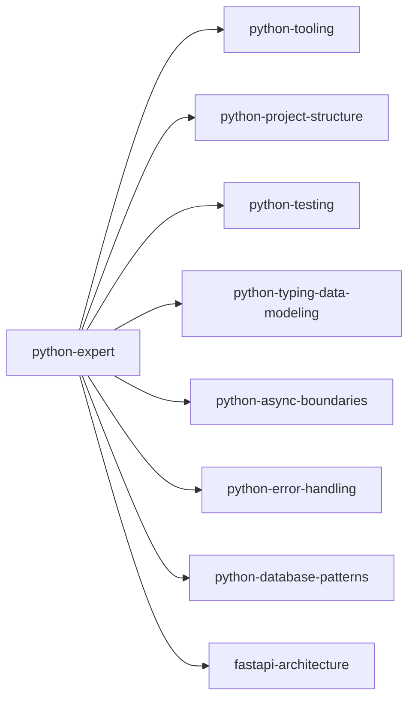
```mermaid
flowchart LR
    PX[python-expert] --> PT[python-tooling]
    PX --> PPS[python-project-structure]
    PX --> PTEST[python-testing]
    PX --> PTDM[python-typing-data-modeling]
    PX --> PAB[python-async-boundaries]
    PX --> PEH[python-error-handling]
    PX --> PDP[python-database-patterns]
    PX --> FA[fastapi-architecture]
```

| Skill                                                                                  | Type      | Description                                                                                                                           |
| -------------------------------------------------------------------------------------- | --------- | ------------------------------------------------------------------------------------------------------------------------------------- |
| [python-expert](registry/python-expert/SKILL.md)                                       | reference | Router for broad Python work - coordinates focused Python and FastAPI skills across tooling, structure, typing, async, errors, database, testing, and API architecture. |
| [python-tooling](registry/python-tooling/SKILL.md)                                     | reference | Preferred Python tooling stack — uv for package management, ruff for linting/formatting, mypy for type checking, pytest, pre-commit, and just. |
| [python-project-structure](registry/python-project-structure/SKILL.md)                 | reference | Organize Python packages, modules, entrypoints, configuration, imports, scripts, services, utilities, and tests.                       |
| [python-testing](registry/python-testing/SKILL.md)                                     | reference | Pytest suites, fixtures, dependency overrides, async tests, mocks, factories, integration tests, and regression coverage.              |
| [python-typing-data-modeling](registry/python-typing-data-modeling/SKILL.md)           | reference | Type hints, Pydantic models, dataclasses, DTOs, `TypedDict`, `Protocol`, validation boundaries, and serialization.                     |
| [python-async-boundaries](registry/python-async-boundaries/SKILL.md)                   | reference | Async boundaries, FastAPI handlers, async database access, background tasks, cancellations, timeouts, and blocking-call risks.         |
| [python-error-handling](registry/python-error-handling/SKILL.md)                       | reference | Python exceptions, domain errors, API/CLI/job boundary translation, logging, retries, validation failures, and rollback behavior.      |
| [python-database-patterns](registry/python-database-patterns/SKILL.md)                 | reference | SQLAlchemy models, sessions, transactions, repositories, migrations, query boundaries, async database access, fixtures, and tests.     |
| [fastapi-architecture](registry/fastapi-architecture/SKILL.md)                         | reference | FastAPI project structure, thin routers, Pydantic schemas, dependency injection, service boundaries, settings, errors, and tests.      |

## Other Skill Collections

| Collection                                                                     | Author     |
| ------------------------------------------------------------------------------ | ---------- |
| [andrej-karpathy-skills](https://github.com/multica-ai/andrej-karpathy-skills) | multica-ai |
| [agent-skills](https://github.com/addyosmani/agent-skills)                     | addyosmani |
| [skills](https://github.com/mattpocock/skills)                                 | mattpocock |
| [gstack](https://github.com/garrytan/gstack)                                   | garrytan   |
| [eng-practices](https://github.com/google/eng-practices)                       | google     |
