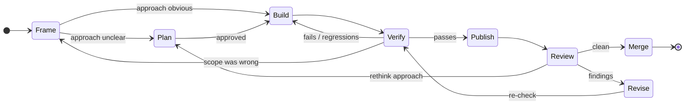
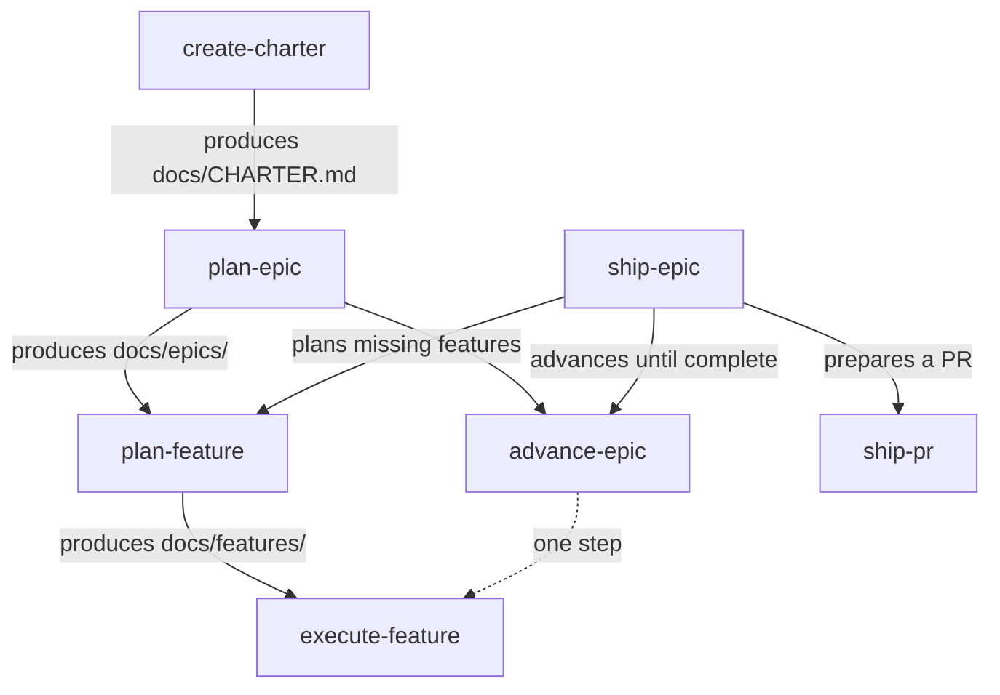

# Skills

This repository is a registry of agent skills. Each skill is a focused `SKILL.md` file that teaches an agent a workflow, convention, or domain-specific judgment pattern.

Use the registry by installing selected skills into the directory your agent client reads, then invoke the relevant skill by name or let the agent choose from the available skill descriptions. See [cli/README.md](cli/README.md) for installation and usage, and [AUTHORING.md](AUTHORING.md) for how to write or update skills.

## Repository Layout

This repository is a skills registry. Active source skills live under
`registry/`, and installers link or copy each selected skill package into the
directory an agent client reads. Archived packages live under `archive/` and
are not discoverable by the installer.

```text
skills/
  registry/
    <skill-name>/
      SKILL.md              # required skill instructions
      agents/
        openai.yaml         # optional agent/client metadata
      references/           # optional templates, examples, rubrics
      scripts/              # optional helper scripts invoked by the skill
      assets/               # optional supporting files
  archive/                  # deprecated packages retained for migration history
  catalog.json              # provenance policy and curated install profiles
  cli/                      # installer and registry tooling
  AUTHORING.md              # how to write and install skills
```

Claude-oriented installs commonly use these locations:

```text
~/.claude/skills/           # personal/global skills
<project>/.claude/skills/   # project-local shared skills
```

Codex or other clients may use analogous roots such as `~/.codex/skills/`, `~/.agents/skills/`, or `<project>/.codex/skills/` depending on client configuration. The registry source remains `registry/<skill-name>/`.

## Skill categories

Every skill falls into one of four categories:

- **Operation** — an abstract step in the unit-of-work lifecycle (below). It
  carries heuristics, gates, and principles that hold across any kind of work,
  not domain-specific mechanics. The operations form a small, stable **kernel**.
- **Runbook** — a concrete, domain-specific procedure an operation delegates to:
  the exact commands and fixed sequence for one task, such as opening a GitHub PR
  or creating a Linear issue. Runbooks are open-ended — a registry can hold
  dozens, and eventually a marketplace of them.
- **Orchestration** — a skill a level *above* a single unit of work, coordinating
  many: planning an epic and driving its features to completion.
- **Reference** — passive knowledge a skill pulls in (conventions, objectives,
  runnable checks); never invoked on its own.

Each skill also declares its **Effect** — read-only, local files, local Git,
network read, or external write — so authorization and stopping points stay
explicit. An operation acts within a single phase and stops at a gate; a runbook
runs one concrete sequence; the feedback edges that send work back to an earlier
phase belong to the lifecycle driver (`ship-pr`), not to any single operation.

`catalog.json` is the machine-readable source for curated install profiles and
external-source preservation policy. Skills not explicitly marked external are
registry-maintained; externally sourced bodies are validated against their origin
commit and updated from upstream rather than edited locally. `core` stays small
and operational; install `advisory` for broad cross-domain reference, `linear-ops`
for the Linear runbooks, and `external-creative` for preserved third-party
references.

## The unit-of-work lifecycle

Every PR is a **unit of work** that moves through eight phases. Each phase is
served by one **operation**; operations delegate concrete mechanics to
**runbooks**; **references** are pulled in as judgment.


```mermaid
stateDiagram-v2
    direction LR
    [*] --> Frame
    Frame --> Plan: approach unclear
    Frame --> Build: approach obvious
    Plan --> Build: approved
    Build --> Verify
    Verify --> Build: fails / regressions
    Verify --> Publish: passes
    Verify --> Frame: scope was wrong
    Publish --> Review
    Review --> Merge: clean
    Review --> Revise: findings
    Review --> Plan: rethink approach
    Revise --> Verify: re-check
    Merge --> [*]
```

The solid forward path is the happy case; the back-edges are the OODA loops — the
tight `Verify → Build` inner loop, the `Review → Revise → Verify` outer loop, and
the `→ Frame` / `→ Plan` escape hatches taken when evidence contradicts the
framing or the approach. `ship-pr` is the **driver**: the operation that runs this
loop end to end for one PR and owns the back-edges. It sits with the operations,
not above them.

| Phase | Question | Operation | Status |
| --- | --- | --- | --- |
| Frame | What is the work? | *(candidate)* | base-model today |
| Plan | What's the approach? | *(candidate)* | base-model today |
| Build | Make the change | *(candidate)* | base-model today |
| Verify | Does it work? | `verify` | built-in |
| Publish | Make it a shared PR | `publish-pr` | concrete — extract runbook |
| Review | Is it correct? | `review-pr` | concrete |
| Revise | Fold in findings | `address-review`, `rebase-pr` | concrete |
| Merge | Deliver it | *(candidate)* | base-model / `gh` today |

The kernel is a work in progress. Operations should be **abstract and
cross-domain** — heuristics and gates, not mechanics — with the exact steps
(the `git`/`gh` sequence to open a PR, the API calls to file a Linear issue)
living in a **runbook** the operation delegates to. Today several phases have no
standalone operation skill yet (Frame, Plan, Build, Merge), and several existing
operations still carry their mechanics inline (`publish-pr`, `review-pr`,
`address-review`); creating the missing operations and extracting the embedded
runbooks is planned work.

Type-specific pathways differ only in the early phases — a bug reproduces in Frame
and adds a regression test in Build; a feature clarifies requirements; a chore
states an invariant — then converge at Publish, which is why the delivery-half
operations are type-agnostic and share one kernel.

## Artifacts

Workflow skills create and consume artifacts inside the target project they are helping with. Durable planning artifacts live under a conventional `docs/` workspace.

Root-level all-caps docs are foundational or constitutional: they describe intent, principles, and operating methods. Derived docs that describe the current state of the codebase live under named subdirectories.

```text
<project>/
  docs/
    CHARTER.md                         # product north star
    METHODS.md                         # project methods, engineering principles, and operating approach
    PRESENTATION.md                    # product presentation, identity, voice, and visual direction
    epics/
      NNN-<slug>.md                    # quarter-level epic plans
    features/
      NNN-<slug>.md                    # feature plans
    tmp/
      wip-<name>.md                    # stash context breadcrumb when trackable
```

`docs/epics/` and `docs/features/` are the standard durable planning surfaces. Product programs and deliberately managed multi-feature initiatives flow through epics. Bounded refactors, security remediations, design-system consolidation, defect fixes, dependency work, and other convergence improvements may go directly from analysis evidence to `plan-feature`; a parent epic is optional in Convergence mode. `docs/tmp/` is reserved for ephemeral WIP handoff notes.

## Operations — the kernel

The small, stable set of skills that complete one unit of work; see the lifecycle
above for how they connect. Install the `core` profile for the PR operations.

| Skill | Phase | Description |
| --- | --- | --- |
| [ship-pr](registry/ship-pr/SKILL.md) | driver | Drive one change through the whole lifecycle to a merge-ready PR — build, verify, publish, then model-diverse review→revise→verify rounds until it converges or hits a bounded stop. Owns the back-edges; stops before merge. |
| [publish-pr](registry/publish-pr/SKILL.md) | publish | Take a branch to a pull request (branch, commit, push, open), or update an existing PR's title and body (sync to the diff, or polish); detects which is needed and forks. Each effect separately authorized. |
| [review-pr](registry/review-pr/SKILL.md) | review | Review a pull request for actionable defects or assess operational and merge risk; post only when explicitly requested. |
| [address-review](registry/address-review/SKILL.md) | revise | Triage inbound reviewer comments — fix, reply, defer, or fold into another PR — then implement, reply to threads, and resolve; gates the push that could dismiss an approval. |
| [rebase-pr](registry/rebase-pr/SKILL.md) | revise | Rebase one or more PR branches onto their base (default staging), reconcile changes upstream already made, then optionally force-push and re-review. |
| [stash](registry/stash/SKILL.md) | cross-cutting | Preserve related in-progress work on a local `wip/` branch in one commit with a context note; shelve or resume from any phase. |
| [trim-comments](registry/trim-comments/SKILL.md) | cross-cutting | Trim low-value comments a branch's diff introduced — process narration, external ticket/plan references, restated-obvious lines — keeping durable rationale and tool directives. |

Frame, Plan, Build, Verify, and Merge are handled by the base model or built-ins
today; they are candidates to formalize as abstract operation skills. Analysis
("what to change"), diagnosis ("why it fails"), and verification ("does it pass")
are base-model capabilities the model performs inline while working.

## Runbooks — concrete procedures

Domain-specific sequences an operation delegates to: exact steps and calls for one
task. This layer is open-ended — the entries below are a start, not a ceiling.

| Skill | Domain | Description |
| --- | --- | --- |
| [create-issue](registry/create-issue/SKILL.md) | Linear | Resolve live workspace fields, create one Linear issue, verify it, and stop. |
| [create-project](registry/create-project/SKILL.md) | Linear | Resolve live workspace fields, create one Linear project, verify it, and stop. |
| [polish-issue](registry/polish-issue/SKILL.md) | Linear | Improve an issue's language without changing its substance or properties. |
| [mindsdb-migrate-surface-to-tailwind](registry/mindsdb-migrate-surface-to-tailwind/SKILL.md) | MindsDB | Migrate one Cowork UI surface's inline styles to Tailwind and design tokens as three separately-committed passes on a draft PR. |
| [mindsdb-track-design-system-metrics](registry/mindsdb-track-design-system-metrics/SKILL.md) | MindsDB | Measure design-system convergence metrics for a configured scope and post one weekly progress comment to a Linear tracking issue. |

Install the `linear-ops` profile for the Linear runbooks and `mindsdb` for the
organization-specific ones. The concrete mechanics currently embedded in the PR
operations (opening a PR, syncing a body) are candidates to extract into runbooks
here.

## Orchestration — above the unit of work

Skills a level above a single unit of work: they plan and coordinate many units
through the shared operations. Install the `product-delivery` profile.


```mermaid
flowchart TD
    CC[create-charter] -->|produces docs/CHARTER.md| PE[plan-epic]
    PE -->|produces docs/epics/| PF[plan-feature]
    PE --> AE[advance-epic]
    PF -->|produces docs/features/| EF[execute-feature]
    SE[ship-epic] -->|plans missing features| PF
    SE -->|advances until complete| AE
    SE -->|prepares a PR| SP[ship-pr]
    AE -.->|one step| EF
```

| Skill | Artifact | Description |
| --- | --- | --- |
| [create-charter](registry/create-charter/SKILL.md) | `docs/CHARTER.md` | Create or refresh a product charter that serves as the north star for all downstream planning. |
| [plan-epic](registry/plan-epic/SKILL.md) | `docs/epics/` | Create or update one charter-aligned epic, deduplicating bug-bash or app-feedback observations into coherent child features. |
| [plan-feature](registry/plan-feature/SKILL.md) | `docs/features/` | Plan one bounded product feature or evidence-backed convergence improvement; parent epics are optional in Convergence mode. |
| [execute-feature](registry/execute-feature/SKILL.md) | one commit | Implement and verify one unchecked item from any feature plan, create one local commit, and stop. |
| [advance-epic](registry/advance-epic/SKILL.md) | one step | Advance an epic by planning and implementing its next incomplete child feature. Run repeatedly until the epic is complete. |
| [ship-epic](registry/ship-epic/SKILL.md) | PR-ready epic | Complete an epic end-to-end — plan missing features, advance until all are complete, validate, and prepare a PR. |

## Reference Skills

Reference skills provide objectives, conventions, and runnable checks the base
model should apply or verify against, rather than method prose it can already
produce. The former `*-expert` routers were evicted once the base model routed
among the focused skills as well without them; consult the skills directly.

### UI

The prose UI family was evicted; what remains is what the model can't derive or
should verify — a collection scale-completeness objective and two runnable checkers.

| Skill                                                | Type      | Description                                                                                                                                           |
| ---------------------------------------------------- | --------- | ----------------------------------------------------------------------------------------------------------------------------------------------------- |
| [ui-patterns](registry/ui-patterns/SKILL.md)         | reference | Collection objectives — match the container to the data, and the scale-completeness checklist (filter/search, pagination, density, empty/overflow) the model tends to omit. |
| [ui-color](registry/ui-color/SKILL.md)               | reference | Color-system objectives plus a runnable WCAG contrast check (`scripts/check_contrast.py`).                                                             |
| [ui-spacing](registry/ui-spacing/SKILL.md)           | reference | Spacing objectives plus a runnable scale-conformance lint (`scripts/check_spacing.py`).                                                                |

### Core Language

| Skill                                                        | Type      | Description                                                                                                                  |
| ------------------------------------------------------------ | --------- | ---------------------------------------------------------------------------------------------------------------------------- |
| [typescript-types](registry/typescript-types/SKILL.md)       | reference | Type-safety objectives (unrepresentable invalid states, no `any`/unsafe casts, derive-from-value, branded ids, exhaustiveness) enforced by `tsc --strict` + `@typescript-eslint/no-unsafe-*`. |

### Shared Conventions

Kernel skills other skills reference for a consistent PR standard and house prose
voice.

| Skill                                                        | Type      | Description                                                                                                                  |
| ------------------------------------------------------------ | --------- | ---------------------------------------------------------------------------------------------------------------------------- |
| [pr-conventions](registry/pr-conventions/SKILL.md)           | reference | The shared PR standard — description shape, conventional commits, GitHub interaction mechanics, and the code-review finding model. |
| [writing-conventions](registry/writing-conventions/SKILL.md) | reference | Shared prose conventions for the concise, human technical writing across PRs, issues, plans, and commit messages. |

### External Design References

These packages retain upstream bodies and are available through the
`external-creative` profile rather than the maintained `advisory` profile.

| Skill                                                | Type      | Description                                                                                                                                           | Origin                                                                                     |
| ---------------------------------------------------- | --------- | ----------------------------------------------------------------------------------------------------------------------------------------------------- | ------------------------------------------------------------------------------------------ |
| [svg-animations](registry/svg-animations/SKILL.md)   | reference | Create performant SVG animations and illustrations: path animations, shape morphing, loading spinners, animated logos, gradients, masks, and filters. | [supermemoryai](https://github.com/supermemoryai/skills/blob/main/svg-animations/SKILL.md) |
| [emil-design-eng](registry/emil-design-eng/SKILL.md) | reference | Design engineering philosophy — polished animations, thoughtful component design, and invisible details that make software feel great.                | [emilkowalski](https://github.com/emilkowalski/skill)                                      |

## Other Skill Collections

| Collection                                                                     | Author     |
| ------------------------------------------------------------------------------ | ---------- |
| [andrej-karpathy-skills](https://github.com/multica-ai/andrej-karpathy-skills) | multica-ai |
| [agent-skills](https://github.com/addyosmani/agent-skills)                     | addyosmani |
| [skills](https://github.com/mattpocock/skills)                                 | mattpocock |
| [gstack](https://github.com/garrytan/gstack)                                   | garrytan   |
| [eng-practices](https://github.com/google/eng-practices)                       | google     |
