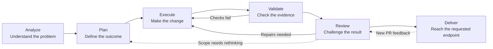

# Skills

A registry built around **one unit of work: one independently reviewable outcome, normally one PR**. Eighteen general skills — six operations, three orchestration skills, six runbooks, and three references — plus two optional organization packages.

The base model supplies general reasoning and technique; skills earn their place through house contracts, corrective objectives, fragile mechanics, or useful verification. The agent owns the task: operations are capabilities, not mandatory steps or approval gates. Existing issues and feature plans are valid work records, and an initiative coordinates several units.

Start with [the shared work contract](registry/work-conventions/SKILL.md) and [authoring rules](AUTHORING.md); [cli/README.md](cli/README.md) covers installation.

## How a unit of work moves

The forward path is a typical change; the return arrows show how evidence and feedback drive another pass.

```mermaid
flowchart LR
    A["Analyze<br/>Understand the problem"] --> P["Plan<br/>Define the outcome"]
    P --> E["Execute<br/>Make the change"]
    E --> V["Validate<br/>Check the evidence"]
    V --> R["Review<br/>Challenge the result"]
    R --> D["Deliver<br/>Reach the requested endpoint"]
    V -->|Checks fail| E
    R -->|Repairs needed| E
    R -.->|Scope needs rethinking| P
    D -.->|New PR feedback| R
```

**Enter where the work needs you.** A clear bug fix can begin at Execute, an existing PR at Review. Skip results already established, reuse current evidence, and stop at the endpoint the user requested — local changes, a commit, an open PR, or an explicitly requested merge, not all of them by default. One work record carries intent, acceptance, progress, and evidence through the loops; an existing issue or feature plan is enough, and a small task may need only its own context.

## The skills

| Kind | What it contributes | Example |
| --- | --- | --- |
| **Operation** | A result within one unit of work | Validate a change against its acceptance criteria |
| **Runbook** | Specific mechanics, callable directly | Publish a PR or create a Linear issue |
| **Reference** | Shared conventions or focused knowledge | The house standard for PR descriptions |
| **Orchestration** | Coordination across several units | Plan an epic and advance its ready units |
| **Organization** | Optional, org-specific tooling | Migrate a MindsDB UI surface to Tailwind |

| Skill | Kind | What it contributes |
| --- | --- | --- |
| [analyze-work](registry/analyze-work/SKILL.md) | Operation | What is happening, and what evidence matters? |
| [plan-work](registry/plan-work/SKILL.md) | Operation | What outcome are we committing to, and how will we prove it? |
| [execute-work](registry/execute-work/SKILL.md) | Operation | What change satisfies that outcome? |
| [validate-work](registry/validate-work/SKILL.md) | Operation | Which requirements does this candidate demonstrably meet? |
| [review-work](registry/review-work/SKILL.md) | Operation | What defects, scope gaps, or delivery risks remain? |
| [deliver-work](registry/deliver-work/SKILL.md) | Operation | Has the work reached the requested endpoint? |
| [shape-initiative](registry/shape-initiative/SKILL.md) | Orchestration | Clarify direction and strategic intent |
| [plan-epic](registry/plan-epic/SKILL.md) | Orchestration | Divide the initiative into work units and dependencies |
| [ship-epic](registry/ship-epic/SKILL.md) | Orchestration | Advance ready units and verify the combined outcome |
| [publish-pr](registry/publish-pr/SKILL.md) | Runbook | Commit, push, create or update a PR |
| [rebase-pr](registry/rebase-pr/SKILL.md) | Runbook | Reconcile a branch with its moving integration base |
| [preserve-work](registry/preserve-work/SKILL.md) | Runbook | Preserve a recoverable local WIP snapshot |
| [create-issue](registry/create-issue/SKILL.md) | Runbook | Create one verified Linear issue |
| [create-project](registry/create-project/SKILL.md) | Runbook | Create one verified Linear project |
| [fan-out](registry/fan-out/SKILL.md) | Runbook | Run parallel subagents on one unit and reconcile the results |
| [work-conventions](registry/work-conventions/SKILL.md) | Reference | Scope, continuation, records, and evidence |
| [pr-conventions](registry/pr-conventions/SKILL.md) | Reference | PR content and review findings |
| [writing-conventions](registry/writing-conventions/SKILL.md) | Reference | Shared prose preferences |
| [mindsdb-migrate-surface-to-tailwind](registry/mindsdb-migrate-surface-to-tailwind/SKILL.md) | Organization | Migrate a MindsDB Cowork UI surface to Tailwind and exact design tokens, preserving behavior |
| [mindsdb-track-design-system-metrics](registry/mindsdb-track-design-system-metrics/SKILL.md) | Organization | Measure reproducible MindsDB UI convergence signals and compare snapshots |

An orchestration kind and its child units use the operations above; independent units can advance while another is blocked, and the initiative still needs its own integration evidence. The two organization packages stay optional and installable on demand.

## Planning artifacts

An epic records a combined outcome and its child units; a work record describes one reviewable outcome. Reuse existing issues and feature plans rather than duplicating them, omit sections that do not apply, and persist enough before a handoff that a fresh worker can continue without the original conversation.

| Document | Name | Description |
| --- | --- | --- |
| `docs/epics/001-<slug>.md` | Epic | Problem, overall acceptance, child links and prerequisites, coordination, decisions, integration |
| `docs/work/001-<slug>.md` | Work unit | Rationale, required acceptance, approach, planned checks, candidate, observed evidence, next action |
| Its current `docs/features/` location | Existing feature plan | Keep a bounded plan as the work record; link child units when the feature spans PRs |
| Linked from its record | Supporting evidence | Detailed measurements, reports, or captures |

Use the [epic template](registry/plan-epic/references/epic-record.md), [work template](registry/work-conventions/references/work-record.md), and [artifact conventions](registry/work-conventions/references/artifacts.md) as defaults. For larger initiatives the coordinator owns the epic index and assignments while each worker owns its unit; [the coordination protocol](registry/ship-epic/references/coordination.md) covers dispatch, checkpoint, replan, integration, and recovery.

## Installation

[cli/README.md](cli/README.md) has the commands. Choose **`general`** for the whole registry or **`core`** for the six operations and their required packages; the rest are focused subsets.

| Profile | Purpose |
| --- | --- |
| `core` | Six work operations with their required contracts and PR mechanics. |
| `orchestration` | Shape, plan, and deliver initiatives across work units. |
| `runbooks` | GitHub, Linear, work-preservation, and fan-out procedures. |
| `general` | The eighteen general skills: operations, orchestration, runbooks, and references. |
| `linear-ops` | Create one verified Linear issue or project. |
| `mindsdb` | Optional organization-specific inventory and migration tools. |

Profiles and individual selections install their required dependencies transitively; optional skill recommendations do not expand a selection. The two `mindsdb-*` packages stay optional.

## Layout

Active packages live in `registry/<name>/`, with conditional references and tools travelling alongside their owner. `catalog.json` is the source of truth for layer, scope, effects, dependencies, resources, profiles, and provenance. `archive/` is historical and not installable. See [the migration map](docs/registry-rebuild.md) for how the current set was reconciled from earlier families, and [evals/README.md](evals/README.md) for behavioral evaluation and its limits.
