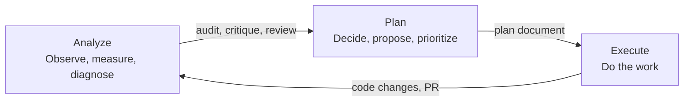

# Standards

Conventions and constraints that skills follow when producing artifacts and referencing project documents.

## Document layout

Skills produce and consume documents within a `docs/` directory at the project root. The directory structure separates documents by their role and rate of change.

### Foundational documents

Files at the top level of `docs/` capture the DNA of the project — its purpose, its visual identity, its design system. These change infrequently and deliberately. They are named in `ALL_CAPS` to signal their weight.

| Document | Produced by | Purpose |
| -------- | ----------- | ------- |
| `docs/CHARTER.md` | `create-charter` | Product charter — north star metric, guiding principles, value proposition, non-goals. |
| `docs/DESIGN_SYSTEM.md` | `extract-design-system` | Design system contract — spacing scale, color tokens, typography, component patterns, layout conventions. |
| `docs/BRAND.md` | (manual or future skill) | Visual brand identity — aesthetic direction, tone, imagery guidelines. |

Foundational documents are upstream of all planning. `plan-epic` and `plan-feature` align against the charter. `design-audit` and `design-fix` enforce against the design system contract.

### Plan documents

Documents in subdirectories represent concrete, time-bounded plans. They are named with a zero-padded numeric ID and a slug: `NNN-<slug>.md`.

| Directory | Produced by | Purpose |
| --------- | ----------- | ------- |
| `docs/directions/` | `explore-directions` | Strategic options — 3–5 distinct directions with evidence, trade-offs, and a decision log. |
| `docs/epics/` | `plan-epic` | Quarter-level initiatives — goals, scope, success criteria, child features. |
| `docs/features/` | `plan-feature` | 1–2 week deliverables — user stories, acceptance criteria, technical notes. |

Plan documents form a hierarchy: directions inform epics, epics contain features. Each level references the one above it.

### Temporary documents

`docs/tmp/` holds transient artifacts — audit reports, session saves, and other working documents that are not part of the permanent record. Files here may be deleted once the work they support is complete.

## Naming conventions

- **Foundational documents**: `ALL_CAPS.md` at `docs/` root.
- **Plan documents**: `NNN-<slug>.md` in a subdirectory of `docs/`.
- **Temporary artifacts**: descriptive name in `docs/tmp/`.
- **Skill files**: `SKILL.md` in `registry/<skill-name>/`.
- **Skill references**: templates and other supporting files in `registry/<skill-name>/references/`.

## Skill types

Skills come in two types:

| Workflow | Reference |
| -------- | --------- |
| Invoked to get something done. Have steps, produce artifacts or code changes, and operate within the phase framework. | Encode knowledge — principles, patterns, conventions, or domain expertise. Inform how work is done across phases rather than driving a specific workflow. |
| Examples: `plan-browser-tests`, `remediate-vulnerability`, `prepare-pr` | Examples: `react-*` principles, `color-expert`, `emil-design-eng` |

## Skill phases

Workflow skills operate in three sequential phases:

| Phase | Description | Output |
| ----- | ----------- | ------ |
| **Analyze** | Observe, measure, diagnose. Understand the current state. | Audit, critique, or review. |
| **Plan** | Decide, propose, prioritize, get buy-in. Chart the path forward. | Plan document. |
| **Execute** | Do the work. Implement the plan. | Code changes, PRs. |

Phases compose sequentially: analysis informs planning, planning guides execution, and execution feeds back into the next cycle of analysis. Some skills span multiple phases (e.g., the redesign skills analyze, propose, and implement in one pass). Others are phase-specific and chain together — `plan-browser-tests` produces a plan that `add-browser-test` executes, one item at a time.