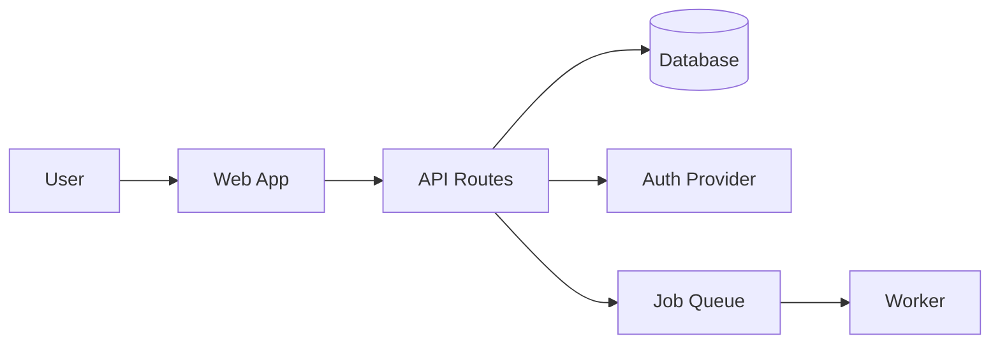
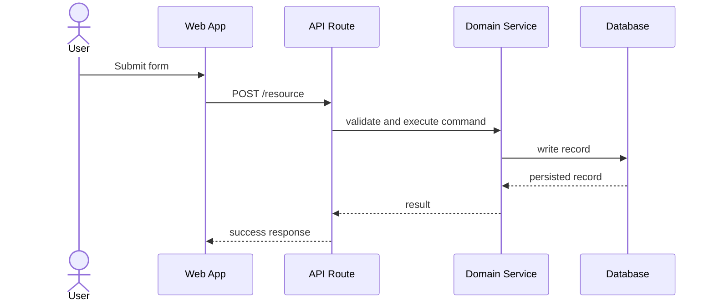

# Document Architecture

## Overview

Create `docs/architecture/ARCHITECTURE.md` from the codebase as it exists. The document should help a new engineer understand how the application is built, where important behavior lives, how data moves, and which boundaries should be preserved.

This is an evidence-first skill. Prefer documented facts from files over guesses. When you infer architecture from code, label it as an inference.

This document is derived, not constitutional. It describes the current application architecture discovered from code and docs. Do not use root-level `docs/ARCHITECTURE.md`; root all-caps docs are reserved for intent, direction, principles, and methods such as `docs/CHARTER.md` and `docs/METHODS.md`.

## Output

Write or refresh `docs/architecture/ARCHITECTURE.md`. If the file already exists, preserve useful current content, correct stale sections, and add missing coverage. Do not create unrelated docs.

Use this structure unless the codebase clearly calls for a different one:

```markdown
# Architecture

## Overview
## System Context
## Runtime Architecture
## Source Map
## Core Domains And Boundaries
## Data Flow
## Data Model
## Integrations
## State, Storage, And Caching
## Authentication And Authorization
## Error Handling And Observability
## Testing Strategy
## Build, Deployment, And Operations
## Architectural Decisions And Trade-Offs
## Open Questions
```

Omit sections that truly do not apply. Add framework-specific sections only when they make the doc clearer.

## Workflow

### 1. Survey the repository

Start broad, then narrow:

```bash
git status --short
rg --files
```

Identify:

- package manifests, lockfiles, workspace files, and build tooling
- app entrypoints, route definitions, server handlers, CLIs, jobs, workers, and scripts
- configuration files, environment examples, deployment files, and infrastructure definitions
- database schemas, migrations, ORM models, generated clients, and seed files
- test setup, integration tests, browser tests, and fixture patterns
- existing docs such as `README.md`, `docs/`, `CONTRIBUTING.md`, and architecture notes

Read the files that define boundaries before reading leaf implementation files. Good targets include `package.json`, `pyproject.toml`, `Cargo.toml`, `go.mod`, framework config, route manifests, app providers, API routers, service modules, schema files, and deployment config.

### 2. Build an architecture map

Document the system at four levels:

- **System context**: users, external systems, hosted services, APIs, queues, storage, and third-party integrations.
- **Runtime architecture**: frontend, backend, workers, jobs, APIs, databases, caches, auth providers, and deployment targets.
- **Source architecture**: top-level directories, feature modules, shared libraries, generated code, tests, and scripts.
- **Behavioral flows**: important request flows, async flows, state transitions, data lifecycle, and failure paths.

Keep a short evidence list while reading. Use file paths in the final doc for important claims, for example:

```markdown
- API routes are defined under `src/routes/`, with auth enforced in `src/lib/auth.ts`.
```

### 3. Choose Mermaid diagrams intentionally

Mermaid diagrams are useful when they clarify relationships faster than prose. Prefer a few high-signal diagrams over a wall of boxes.

Use these diagram formats:

| Need | Mermaid Format | Guidance |
| --- | --- | --- |
| System context, containers, services, module dependencies | `flowchart` | Best default for architecture. Use `flowchart LR` for left-to-right systems and `flowchart TD` for layered architecture. |
| Cloud resources or infrastructure topology | `architecture-beta` | Use only when the project's Mermaid renderer supports Mermaid v11.1.0+ and beta syntax is acceptable. Otherwise use `flowchart` with `subgraph`. |
| Request flow, user journey, event flow, async processing | `sequenceDiagram` | Use for ordered interactions between actors, UI, API, services, queues, and databases. |
| Database/domain relationships | `erDiagram` | Use only when schema/model files exist and relationships are clear. |
| Classes, interfaces, or object-oriented boundaries | `classDiagram` | Use sparingly. Avoid using it for ordinary React component trees. |
| Lifecycle or workflow states | `stateDiagram-v2` | Use when entities move through meaningful states. |

Diagram rules:

- Prefer `flowchart` for system design and architecture docs; it is the most broadly useful Mermaid format.
- Use C4-style structure with `flowchart` and `subgraph` blocks instead of relying on Mermaid C4 extensions.
- Treat `architecture-beta` as optional: it can be excellent for cloud and CI/CD topology, but `flowchart` is safer for Markdown renderers with older Mermaid versions.
- Quote node labels that contain punctuation, paths, or parentheses.
- Keep diagrams readable: roughly 5-12 nodes each. Split large systems into multiple diagrams.
- Group related nodes with `subgraph` for clients, application, data, external services, and infrastructure.
- Show direction with meaningful edge labels such as `reads`, `writes`, `calls`, `publishes`, `subscribes`, or `authenticates`.
- Do not diagram relationships you cannot support from code or docs.

Example system diagram:



Example request flow:



### 4. Write the architecture document

The document should be concise but complete enough to onboard an engineer.

Include:

- a one-paragraph overview of what the application is and how it is shaped
- diagrams for system context and the most important flows
- a source map table that explains where key code lives
- the main domain boundaries and why they exist
- data ownership and persistence patterns
- integration boundaries and external dependencies
- auth, authorization, error handling, observability, and testing approach
- deployment and runtime assumptions
- known trade-offs, risks, and open questions

Avoid:

- listing every file in the repository
- copying large code snippets
- inventing aspirational architecture not reflected in the code
- treating implementation details as architectural decisions unless they affect boundaries, data flow, deployment, reliability, or extensibility
- turning the doc into a tutorial for the framework

### 5. Validate the doc against the code

Before finishing:

1. Re-check the files that support the most important claims.
2. Search for names used in diagrams to ensure they match the codebase vocabulary.
3. Run a markdown or docs validation command if the project has one.
4. Run `git diff --check`.
5. Report any areas that remain uncertain because the codebase lacks docs, schema, config, or deployment evidence.

## Existing Architecture Docs

If `docs/architecture/ARCHITECTURE.md` already exists:

- Preserve accurate decisions and useful diagrams.
- Remove or correct stale claims.
- Add an "Open Questions" item for ambiguous behavior instead of pretending certainty.
- Prefer incremental updates over a full rewrite unless the current doc is structurally unusable.

If legacy `docs/ARCHITECTURE.md` exists at the project root, treat it as a legacy architecture artifact. Move or recreate the accurate current-state content under `docs/architecture/ARCHITECTURE.md`, and do not leave the root file as the primary output unless the user explicitly asks to preserve the legacy path.

## Final Response

Summarize:

- whether `docs/architecture/ARCHITECTURE.md` was created or refreshed
- the main architecture areas covered
- Mermaid diagrams included
- validation performed
- remaining uncertainties or follow-up recommendations
