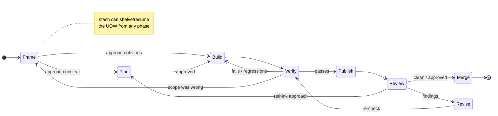
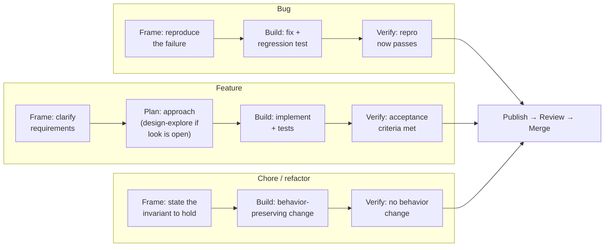

> Historical design record preserved from main. Current architecture and dispositions are in [registry-rebuild.md](registry-rebuild.md).

# The unit-of-work lifecycle

A proposed organizing model for the PR skills: treat every PR as a **unit of work
(UOW)** that moves through a small set of **phases**, and treat each skill as an
**operation-verb** that acts inside one phase. This extends two principles the
registry already holds — *the PR is the discrete unit of delivery*, and *the
registry is operation-verbs on a unit of work* — by naming the phases those verbs
belong to and the feedback edges between them.

The shape is an OODA loop, not an assembly line. Work does not flow strictly
forward; new evidence at any phase can send it back to an earlier one. That
back-flow is the point.

## The phases

Each phase answers one question. The OODA column shows the mapping the model is
built on; the gate is what must be true to leave the phase.

| Phase | Question | OODA | Skills that act here | Exit gate |
| --- | --- | --- | --- | --- |
| **Frame** | What is the work, really? | Observe | *base-model inline*: read the issue, reproduce, gather context; `create-issue` / `polish-issue` when the UOW *is* a ticket | The problem and its done-condition are stated |
| **Plan** | What is the approach? | Orient | `plan-feature`, `plan-epic`, `create-charter`, `design-explore` (open UI); `advance-epic` / `ship-epic` orchestrate | An approach is chosen and, if needed, approved |
| **Build** | Make the change. | Act | `execute-feature`; domain guidance: `typescript-types`, `ui-*`, `emil-design-eng`, `svg-animations`, `dataviz`; `trim-comments` | The change exists as local commits |
| **Verify** | Does it actually work? | Act → Observe | `verify` (otherwise base-model inline) | Behavior is confirmed end-to-end |
| **Publish** | Make it a shared UOW. | Act | `prepare-pr`, `update-pr` | Branch pushed, PR open, metadata fits the standard |
| **Review** | Is it correct and ready? | Observe → Decide | `review-pr`, `code-review`, `harden-pr` (self-review loop) | A merge/revise decision is made |
| **Revise** | Fold in what review found. | Orient → Act | `address-review` (inbound human), `harden-pr` (self), `rebase-pr` (base drift), `trim-comments` | Findings are resolved or deferred |
| **Merge** | Deliver it. | Act | *base-model / `gh`*; the publish/harden skills deliberately stop short of merge | UOW integrated — terminal |

`stash` is **cross-cutting**: from any phase you can shelve the UOW and resume it
later in the same phase. `pr-conventions` is the **shared kernel** every
Publish/Review/Revise verb reads, not a phase of its own.

## The state machine

The forward path (`Frame → … → Merge`) is the happy case. The value is in the
back-edges:

- **Verify → Build** — the tight inner loop; most iteration lives here, before
  anything is published.
- **Review → Revise → Verify** — the outer loop; every fix re-enters Verify so a
  review-driven change is held to the same behavioral bar as the original.
- **Verify → Frame / Review → Plan** — the OODA escape hatches. When evidence
  contradicts the framing or the approach, work jumps back rather than patching
  forward. This is the same "new evidence returns work to analysis/planning"
  edge the README already draws for the planning stages.

## Type-specific pathways

The states are the same for every UOW; the *content* of the early phases differs
by issue type. A bug and a feature diverge in Frame, Build, and Verify, then
rejoin at Publish.

- **Bug** — Frame is a reproduction; Build adds a regression test alongside the
  fix; Verify's gate is that the reproduction no longer fails. Plan is usually
  skipped.
- **Feature** — Frame clarifies requirements; Plan is load-bearing and may
  branch into `design-explore` when the UI look is open; Verify checks against
  acceptance criteria.
- **Chore / refactor** — the invariant is "behavior unchanged." Plan is usually
  skipped; Verify's whole job is to prove nothing observable moved.

From Publish onward the pathways are identical — which is why the Publish/Review/
Revise/Merge verbs are type-agnostic and share one `pr-conventions` kernel.

## What the model buys us

- **A slot for every verb.** Each PR skill maps to exactly one phase (except the
  cross-cutting `stash` and the kernel `pr-conventions`), which makes overlaps
  and gaps visible.
- **A named home for feedback.** The back-edges are first-class, so "re-verify
  after a review fix" and "rethink the approach on new evidence" are part of the
  architecture, not ad-hoc.
- **Type variation without state explosion.** Bug/feature/chore differ only in
  the first three phases; the delivery half is shared.

## Open questions for the redesign

- **Frame and Merge have no dedicated skill** — both are base-model inline today.
  Is that the right call, or does either warrant a thin verb (e.g. a merge-gate
  checklist)?
- **`harden-pr` spans Review + Revise + Verify** as one loop. Keep it as a
  composite loop skill, or is the composite itself the unit worth naming?
- **Does the model generalize** beyond a PR to a Linear issue or an epic as the
  UOW, or is the PR-specific delivery half (Publish → Merge) load-bearing enough
  that other UOW types need their own tail?
